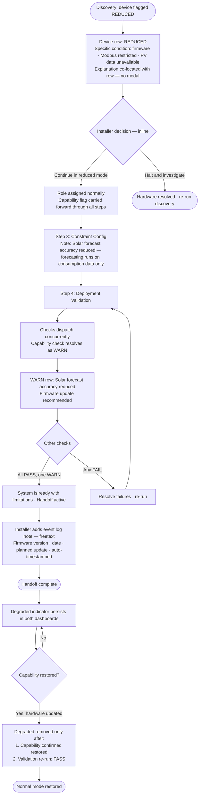
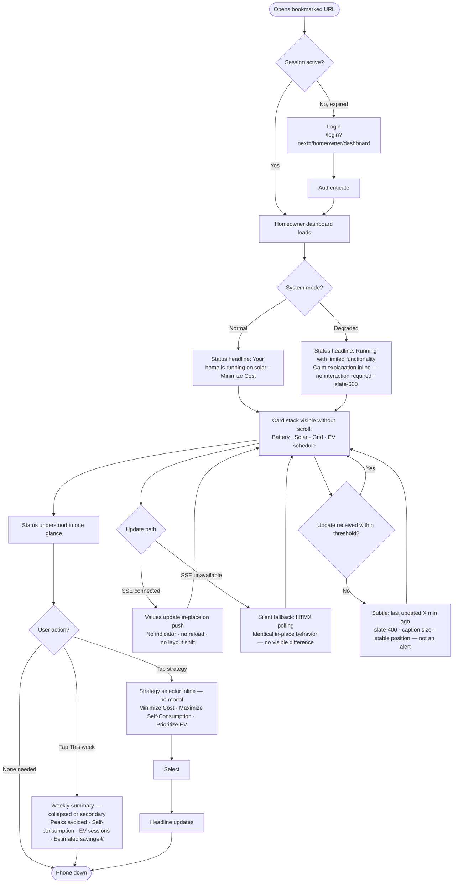
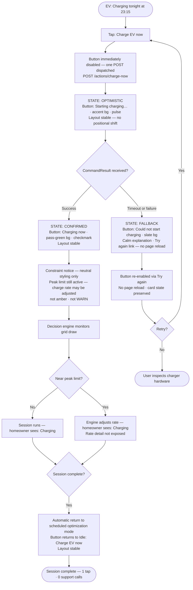
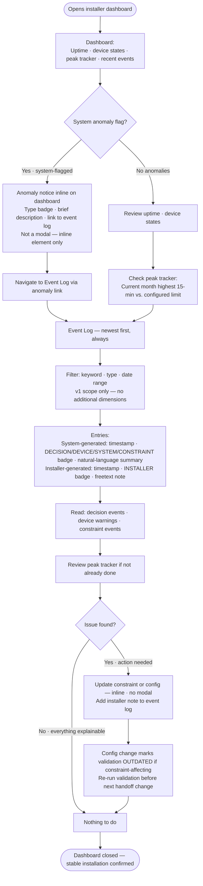

# UX Design Specification — OPEN-EMS

**Author:** Jordan
**Date:** 2026-05-01

---

## Project Understanding

### Product Vision

OPEN-EMS is a local-first energy orchestration platform delivered as a web application running on-site hardware. It serves two completely distinct audiences through a role-separated interface: professional energy installers who configure and validate the system once per site, and homeowners who interact with it occasionally for status and simple actions.

The system succeeds not when users engage with it frequently, but when it operates autonomously and builds trust through predictable, explainable behavior.

### Target Users

**Installer / Admin — "Lien"**
Independent residential energy installer, ~20 installations/year, Belgium. Interacts with OPEN-EMS primarily at deployment time (1–4 hours on-site) and occasionally for remote monitoring. Desktop/laptop is the primary setup device. Technically literate; values structure, repeatability, and professional confidence. Her measure of success: walks away from a deployment and the system runs without any call-backs.

**Homeowner / User — "Marc"**
Daily operator. Not technical. Mobile phone is the primary device (app bookmarked on home screen). Interacts briefly (under 10 seconds for a status check) and infrequently (strategy switch, occasional EV override). His measure of success: sees "everything is fine" and puts his phone down.

### Key UX Design Challenges

1. **Role isolation with a single web app** — Two audiences, one URL, completely different information needs. Each role's view must feel purpose-built, not filtered.

2. **Sequential setup vs. flexible post-deployment reconfiguration** — Installer setup is a linear flow (discover → assign → constrain → validate → hand off); post-deployment changes are non-linear. Both modes must be handled cleanly.

3. **Dual-audience degraded-mode messaging** — The same system condition requires a plain "limited functionality" card for the homeowner and a structured diagnostic log entry with actionable detail for the installer.

4. **Trust through invisibility (homeowner)** — The homeowner dashboard succeeds when the user doesn't feel compelled to act. Designing for non-engagement and reassurance is harder than designing for clicks.

5. **Frictionless override with embedded safety notice** — "Charge EV now" must feel immediate, but surface a one-line constraint notice without triggering hesitation or suggesting a multi-step confirmation.

### Design Opportunities

1. **Deployment validation as a confidence ceremony** — The installer's pass/warn/fail validation moment can be designed as a professional handoff ritual, not just a status screen — giving Lien the clear signal she needs to walk away.

2. **Homeowner dashboard as a weather-app readout** — Glanceable, reassuring, no decisions required. Battery, solar, grid, EV next session — under 10 seconds.

3. **Event log as the system explaining itself** — Plain-language decision entries give the installer a self-service audit trail; the system proves it's working correctly without requiring a support call.

4. **Strategy selection as meaningful, simple agency** — Three options defined by outcomes (not technology), easy to switch, always visible. The one place the homeowner feels in control without being overwhelmed.

## Core User Experience

### Defining Experience

OPEN-EMS has two fundamentally different core experiences, one per role.

For the homeowner, the core experience is **passive reassurance**: opening the interface, confirming the system is working correctly, and closing it — in under ten seconds, with no action required. The critical interactive moment is the "Charge EV now" override: a single tap that works immediately, with no friction. Success is defined by non-engagement: the homeowner never feels compelled to do anything the system hasn't already handled.

For the installer, the core experience is **structured confidence**: a sequential setup flow that guides discovery, assignment, configuration, and validation — and culminates in an explicit system-generated pass/fail result before the installer leaves the site. Post-deployment, the core experience is **remote transparency**: checking in via the event log and seeing the system explaining its own decisions in plain language.

### Platform Strategy

- **Single web application** served locally from on-site hardware over HTTPS
- Works on the local network without internet connectivity; all static assets are vendored locally — no CDN dependency
- **Homeowner:** mobile-first; designed for a phone bookmarked on the home screen; all critical information fits on a single mobile screen without scrolling
- **Installer setup:** desktop/laptop preferred; structured multi-step flow benefits from a larger screen; mobile access supported for monitoring use cases
- **No native app in v1** — web interface only; browser support: current Chrome, Edge, Safari, Firefox

### Effortless Interactions

| Interaction | Who | Design target |
|---|---|---|
| Status glance | Homeowner | Zero interaction — open, read, close |
| "Charge EV now" | Homeowner | Single tap; immediate feedback; no confirmation dialog |
| Device discovery | Installer | Automatic scan; no manual IP entry or config file editing |
| Role assignment | Installer | Visual picker per device; not a configuration editor |
| Deployment validation | Installer | One-click trigger; explicit PASS / WARN / FAIL per check |
| Event log review | Installer | Chronological list with plain-language explanations; no decoding required |

### Critical Success Moments

1. **The handoff signal** — The deployment validation screen shows a PASS result. The installer reads "All checks passed. System is ready." and walks away confident. This is the moment the platform earns professional trust.

2. **First homeowner dashboard view** — Marc opens the app for the first time after Lien leaves. He sees battery level, solar production, grid draw, and next EV session in under ten seconds without reading any instructions. He understands the system.

3. **First EV override** — Marc taps "Charge EV now." Charging begins immediately. A single-line notice confirms the peak limit is still active. Marc doesn't need to understand what that means — he just sees it's working.

4. **Remote check-in three weeks later** — Lien opens the event log from her office. She sees 47 decision events, all explained in plain language. No anomalies she can't explain. She closes the dashboard and moves on. No call required.

### Experience Principles

1. **Invisible excellence** — The best interaction is the one that doesn't need to happen. Design for non-engagement and autonomous operation first; interaction second.

2. **Confidence at handoff** — The installer's experience culminates in a single, unambiguous go/no-go signal. Every step in the setup flow exists to make that moment trustworthy.

3. **Role clarity over role overlap** — Each user sees only what is relevant to their role. No shared views, no filtered sections, no "you don't have permission" messages. The role boundary is structural, not cosmetic.

4. **Plain language always** — Every status message, warning, and log entry is written for the audience who receives it. No register names, no protocol error codes, and no raw numeric values without units and context in the homeowner view.

5. **Explain before asking** — When the system surfaces a warning, status change, or degraded-mode condition, it states what is happening and why before presenting any options. Users should never have to ask "what does this mean?"

## Desired Emotional Response

### Primary Emotional Goals

**Homeowner — "Calm trust"**
Marc should feel that something competent and reliable is looking after his home's energy. Not excited, not engaged — quietly reassured. The emotional model is a passenger on a smooth flight: aware that a system is in control, comfortable not thinking about it. When the system surfaces information, it should feel like a calm status update, not an alert.

**Installer — "Professional confidence"**
Lien should feel that she is doing her job well, using a tool that matches her professionalism. The setup flow should feel organized and deliberate, not like navigating an unfamiliar system. At deployment validation, the emotion is accomplishment: "I've configured this correctly and I can walk away." Post-deployment, it's quiet reassurance: the system explains itself, she trusts it, and she moves on.

### Emotional Journey Mapping

**Installer setup flow:**

| Stage | Desired emotion | Risk to avoid |
|---|---|---|
| Device discovery | Organized, in control | Uncertainty ("Did it find everything?") |
| Role assignment | Methodical, systematic | Confusion about what each role means |
| Constraint configuration | Deliberate, careful | Doubt about whether values are correct |
| Deployment validation — PASS | Accomplished, trusted | Anticlimax if the result feels ambiguous |
| Deployment validation — WARN/FAIL | Informed and capable | Alarm or vagueness about next steps |
| Post-deployment check-in | Reassured, professionally satisfied | Anxiety about unexplained log entries |

**Homeowner experience:**

| Moment | Desired emotion | Risk to avoid |
|---|---|---|
| First dashboard view | Oriented, not confused | Overwhelm from too much information |
| Normal daily glance | Calm, unbothered | Anything requiring a decision |
| Strategy selection | Meaningfully in control | Decision paralysis from unclear options |
| EV override | Empowered, capable | Hesitation from a warning-like confirmation |
| Degraded-mode indicator | Mildly aware, not alarmed | Panic from technical error framing |
| Weekly summary (nice-to-have) | Quietly proud, satisfied | Indifference if savings feel abstract |

### Micro-Emotions

**Confidence over doubt** — every screen must leave the user more certain, not less. For the installer: validation results must be unambiguous. For the homeowner: status must always show that the system is working, even in limited mode.

**Trust over skepticism** — the system earns trust by explaining itself. The event log (installer) and the status card (homeowner) are the primary trust-building surfaces. If the system behaves without explanation, skepticism follows.

**Empowerment over helplessness** — when the homeowner takes an action (override, strategy switch), it must work immediately and visibly. Delayed feedback or unclear results create helplessness. The one-tap override is the clearest test of this principle.

**Calm over urgency** — error states, warnings, and degraded modes must not feel alarming. The system is designed to handle these conditions — the UI should communicate that the system is managing the situation, not escalating it to the user.

### Design Implications

| Emotional goal | UX design approach |
|---|---|
| Calm trust (homeowner) | Clean layout; minimal color; status indicators use calm language, not alert language; no red for normal degraded state |
| Professional confidence (installer) | Explicit progress through setup steps; clear validation outcomes with per-check detail; no ambiguous pass states |
| Quiet pride (homeowner) | Outcome-positive framing: "Saved €18 this week" rather than "Consumption reduced by X kWh" |
| Empowerment (homeowner) | Single-tap actions with instant, visible feedback; no confirmation dialogs for the EV override |
| Informed and capable (installer) | Structured, scannable event log; actionable warnings with suggested next steps; no raw error codes |
| Trust through explanation (both) | Every system decision surfaces a plain-language reason; log entries are never bare timestamps |

### Emotional Design Principles

1. **Calm is the default** — the interface rests in a calm, reassuring state. Alerts and warnings are reserved for conditions that genuinely require attention. Overusing warning states erodes trust in the signal.

2. **Earn trust through explanation** — every action the system takes autonomously should be explainable in plain language. If the system can't explain it, the UI shouldn't show it.

3. **Accomplishment is visible** — the installer's work should feel complete and definitive at the validation moment, not vague. The homeowner's results (energy saved, peaks avoided) should feel tangible, not abstract.

4. **No alarm without context** — degraded-mode conditions are communicated with a calm explanation of what is limited and what is still working. The system never just raises a flag; it always answers "and here's what that means for you."

5. **Empowerment through immediacy** — when a user takes action (override, strategy switch, constraint change), feedback is immediate and visible. Waiting for confirmation is anxiety; instant response is control.

## UX Pattern Analysis & Inspiration

### Inspiring Products Analysis

**Apple Weather (homeowner dashboard reference)**
What it does well: layered information at multiple depths — current in 2 seconds, forecast in 5, detail on demand. The primary view never requires a decision.
Transferable: the homeowner dashboard "rest state" — readable in under 10 seconds, organized by urgency (current first, next EV session second, trends third).

**Nest thermostat (homeowner status reference)**
What it does well: when the system is working, the display is calm and minimal. The device explains what it's doing ("Heating to 21°" / "Schedule active") without requiring the user to know why. Warnings surface only when user attention is genuinely needed. The "auto" mode is the default and is trusted.
Transferable: the homeowner status card — "Running on solar" / "Charging EV tonight at 22:30" style plain-language summaries replace technical metrics. The system describes its behavior, not its state.

**Vercel / Railway deployment screens (installer validation reference)**
What it does well: deployment results are structured as per-check rows — each with a clear pass / warn / fail indicator, a one-line description, and expandable detail on failure. The overall result is the first visual element. When all checks pass, the screen communicates "done" unambiguously.
Transferable: deployment validation screen — per-check result rows with PASS / WARN / FAIL badges, overall status as the headline, expandable detail only on failure or warning.

**Stripe event log (installer event log reference)**
What it does well: timestamped entries with human-readable summaries, structured metadata, status badges, and filtering. High information density without cognitive overload. Entries never require decoding — "Payment succeeded · $49.00 · card ending 4242" is immediately understandable.
Transferable: the installer event log — "Battery discharged to prevent peak · 14:22 · grid draw reduced from 4.8 kW to 2.1 kW" style entries. Badge for event type. Plain language first. Expandable technical detail second.

**Linear (installer dashboard reference)**
What it does well: professional density. The interface trusts that the user is capable and structures information accordingly — without falling into "developer tool" opacity. Status indicators are clear and meaningful, not decorative.
Transferable: installer dashboard visual language — structured, compact, professional. No consumer-soft styling; no decorative charts without functional purpose.

### Transferable UX Patterns

**Navigation patterns:**
- **Role-resolved routing** (from enterprise SaaS): after login, users land directly in their role's home screen. No role-selection UI; no "which dashboard?" choice. The system knows who you are and takes you there.
- **Contextual back-navigation** (from mobile apps): in the installer setup flow, progress is shown and steps can be revisited — but the flow has a clear direction. Not a wizard (no lock-in), not a free-form form (no lost orientation).

**Interaction patterns:**
- **Destructive-action immediacy** (from Stripe, Linear): actions that matter (override, strategy switch, constraint activation) are single-step with immediate feedback. Confirmation dialogs are reserved for irreversible destructive operations only — not for routine actions.
- **Inline validation** (from modern form UX): constraint fields validate as the installer types, with immediate feedback on range and consistency. No "submit and see 6 errors" pattern.
- **Progressive disclosure** (from Vercel deployment screens): validation results show status at a glance; detail is available on expansion. The installer reads the headline first; drills down only if needed.

**Visual patterns:**
- **Status badge language** (from CI/CD tools): PASS (green), WARN (amber), FAIL (red) — consistent across validation results, event log entries, and device connectivity indicators. Three states, clearly distinct, never overloaded with additional variants.
- **Calm primary state** (from Nest, Apple Weather): when everything is working, the dominant visual impression is clean and minimal. Color is used to confirm normalcy, not to decorate.
- **Outcome-positive framing** (from Apple Fitness, Monzo): results are framed in terms of what was achieved, not what was consumed. "Saved €18 this week" outperforms "Used 42 kWh less than unmanaged baseline."

### Anti-Patterns to Avoid

1. **Dashboard metric overload** (Home Assistant, SolarEdge) — showing every available metric simultaneously. Creates cognitive load without decision value. OPEN-EMS v1 shows what the user needs to act (or not act); nothing else.

2. **Alert fatigue** (generic smart home apps) — overusing warning colors and notification states until users stop reading them. OPEN-EMS reserves red for genuine fail states; amber for warnings requiring optional attention; normal operating states use neutral or positive colors only.

3. **Technical leak** (EVCC, raw inverter apps) — displaying register names, protocol error codes, or raw numeric values without context in user-facing views. The homeowner interface has a strict no-technical-data rule. Even the installer event log translates events into plain language before showing them.

4. **Setup wizard lock-in** (IoT device setup flows) — linear flows where steps cannot be revisited, errors cannot be corrected, and progress is lost on interruption. The installer setup flow has a clear direction but is not a locked wizard.

5. **Ambiguous status** (generic monitoring tools) — "Connected" without confirming capability; "3 devices found" without confirming roles. OPEN-EMS status indicators always answer both "is it connected?" and "is it doing what it should be doing?"

6. **Multi-step confirmation for routine actions** — confirmation dialogs for the EV override or strategy switch. These are bounded by safety constraints at the system level; the UI does not need to add friction on top.

### Design Inspiration Strategy

**Adopt directly:**
- Vercel-style per-check deployment validation result rows
- Stripe-style event log entry format (timestamp + badge + plain-language summary + expandable detail)
- Three-state badge system: PASS / WARN / FAIL with consistent color mapping

**Adapt for OPEN-EMS:**
- Apple Weather's layered information hierarchy → homeowner dashboard card stack (current state top, EV next session middle, weekly summary bottom)
- Nest's "system is handling it" calm state → homeowner status language ("Running normally · Minimize Cost strategy active")
- Linear's professional density → installer dashboard layout (data-rich but scannable)

**Avoid entirely:**
- Multi-panel energy monitoring dashboards (SolarEdge, Grafana style)
- Any raw protocol or register data in user-facing text
- Confirmation dialogs for the EV override and strategy switch
- Alert states for normal degraded operating conditions

## Design System Foundation

### Design System Choice

**Custom design token system built on Tailwind CSS pre-compiled output**

Tailwind CSS CLI is used as a development-time compilation tool only. The compiled utility output is committed to the repository as a vendored static asset (`static/open-ems.css`) and served locally — no CDN, no runtime Node.js dependency, no build step required to run the application. This is fully compatible with the FastAPI + Jinja2 + HTMX + Alpine.js architecture.

A set of CSS custom properties (design tokens) defines the shared visual language across both the installer and homeowner template trees:

```css
/* Core tokens — defined in open-ems.css */
--color-pass: #16a34a;        /* PASS state — green */
--color-warn: #d97706;        /* WARN state — amber */
--color-fail: #dc2626;        /* FAIL state — red */
--color-status-ok: #64748b;   /* Calm neutral — system healthy */
--color-surface: #f8fafc;     /* Page background */
--color-card: #ffffff;        /* Card background */
--color-border: #e2e8f0;      /* Subtle borders */
--font-mono: ui-monospace, monospace;   /* Event log, timestamps */
--font-sans: system-ui, sans-serif;    /* All UI text */
```

### Rationale for Selection

1. **Architecture compatibility** — The OPEN-EMS architecture explicitly mandates no frontend build pipeline and no heavy JS framework. React-based design systems are incompatible. Tailwind pre-compiled output and custom CSS are the only options that satisfy this constraint without compromise.

2. **Small team, fast iteration** — Tailwind's utility-first approach lets a team of 3 compose UI quickly in Jinja2 templates without switching between HTML and CSS files. Component styles that need semantic names (`.badge-pass`, `.card-status`) are defined as Tailwind `@apply` directives in `open-ems.css`.

3. **Two distinct visual registers** — The installer view needs professional density; the homeowner view needs calm minimalism. A custom token system lets both template trees draw from the same foundation while expressing different visual weights. A pre-built framework would constrain this divergence.

4. **Zero runtime dependency** — All assets are local. The system works with no internet access. No CDN availability risk. This is non-negotiable for a locally-hosted platform deployed in residential settings.

5. **Aligned with inspiration sources** — The design language draws from Stripe, Linear, and Vercel — all of which use custom or minimally-constrained design systems. A generic Bootstrap or Material skin would undermine the professional credibility the installer view requires.

### Implementation Approach

**Development workflow:**
- Tailwind CLI generates `static/open-ems.css` from a `tailwind.config.js` and source CSS file
- The compiled output is committed to the repository; no Tailwind runtime is needed to serve or run the application
- Tailwind CLI is a dev dependency only; it does not ship with the application

**Component approach:**
- Semantic component classes defined via Tailwind `@apply` directives:
  - `.badge` `.badge-pass` `.badge-warn` `.badge-fail` — status badges
  - `.card` `.card-header` `.card-body` — content containers
  - `.status-row` — event log and validation result rows
  - `.nav-installer` `.nav-homeowner` — role-specific navigation bars
  - `.btn` `.btn-primary` `.btn-override` — action buttons
- All Jinja2 templates reference these semantic class names, not raw Tailwind utilities, to keep templates readable and component styles centralized

**Typography:**
- System font stack for all UI text — no web fonts; no external font CDN
- Monospace for event log timestamps and technical values (installer view only)
- Font sizes follow Tailwind's default scale; no custom type ramp needed in v1

### Customization Strategy

**Installer view** — Professional register: higher information density, tighter spacing, monospace timestamps, structured table-like layouts for device lists and event logs. Badge system (PASS / WARN / FAIL) is the primary status communication mechanism.

**Homeowner view** — Calm register: generous spacing, larger text for key status values (battery %, PV production, grid draw), minimal color usage, no tables or dense lists. Status is communicated through natural-language cards, not badges or data rows.

**Shared elements** — Login screen, degraded-mode banners, and system health indicators use the shared token set. Role-specific templates extend from `base.html` but override the layout and density tokens appropriate to their audience.

## Defining Experiences

### The Two Defining Interactions

OPEN-EMS has two defining experiences — one per role — that, if executed well, make everything else follow.

**Installer: "The validation that ends with certainty"**
The installer completes the setup flow and triggers deployment validation. The system checks device connectivity, role assignments, constraint completeness, and control readiness — then returns an explicit, per-check result. When the overall status reads PASS, the installer has professional confirmation that the system is ready. She can hand over and walk away.

**Homeowner: "The glance that confirms everything is handled"**
The homeowner opens the app and reads the current status in under 10 seconds: battery at 81%, solar producing, EV charging tonight at 22:30, strategy: Minimize Cost. No action required. The system is doing its job. Phone goes down.

### User Mental Models

**Installer mental model — commissioning engineer**
Lien thinks in structured steps: find the devices, assign them, set the limits, confirm it works. She expects the system to behave like professional commissioning software: explicit steps, explicit confirmation, no ambiguity about what was found or what was configured. She is skeptical until proven otherwise — the validation result is the proof.

What she currently uses: multiple manufacturer apps + manual Home Assistant automations. Every installation is slightly different. She has no standard process that gives her confidence.

What she brings to OPEN-EMS: expectation of structure and repeatability. She wants to follow the same steps every time and get the same reliable result.

**Homeowner mental model — thermostat user**
Marc thinks in outcomes: is the house doing what it should? He does not think about devices, protocols, or strategies. He checks a status, not a control panel. He is most similar to someone checking a thermostat display: current state, scheduled next action, confirmation that the system is active.

What he currently uses: three manufacturer apps he does not understand. He has learned not to trust them.

What he brings to OPEN-EMS: low expectations, potential skepticism. The first dashboard view must be immediately comprehensible — if he has to read instructions or ask a question, the design has not done its job.

### Success Criteria

**Installer deployment validation success:**
- All checks complete or time out within a bounded window — validation never hangs indefinitely
- Each check result is self-explanatory without reference to external documentation
- WARN results include a specific, actionable next step — not just a flag
- FAIL results explain exactly what needs to change before the system is deployable
- The overall PASS result is the primary visual element — unambiguous, not buried
- The installer feels confident enough to close the interface after seeing PASS

**Homeowner status glance success:**
- Total time from opening the URL to understanding system state: under 10 seconds
- No interaction required to understand the current state in either normal or degraded mode
- No labels require explanation — all text is self-contained plain language
- The "EV charge scheduled" item is visible without scrolling on a standard phone
- After viewing, the homeowner can accurately describe system state to another person
- Degraded-mode status is visible and calm, never alarming

**EV override success:**
- Single tap initiates the action — no confirmation dialog
- Optimistic UI feedback appears within 2 seconds of tap
- Confirmed state updates once CommandResult is received from the system
- On failure or timeout, a clear fallback state appears with a calm explanation
- The constraint notice is present but does not feel like a warning

### Pattern Analysis

**Established patterns — adopt and refine:**
- **Status card stack** (homeowner dashboard) — well-understood from weather apps and Nest; users know how to read this format; no education required
- **Per-check validation result list** (deployment validation) — identical to CI/CD pipeline results; technically literate installers recognize this pattern immediately
- **Optimistic UI with confirmed state** (EV override) — standard mobile pattern; immediate feedback prevents perceived latency while system confirms the action
- **Chronological event log with badges** (installer dashboard) — established from Stripe, Linear, GitHub; familiar to professional tool users

**Where we innovate within established patterns:**
- The status card language — using behavior descriptions ("Running on solar") rather than metric readouts ("PV: 2.1 kW, Grid: 0 W") is an adaptation of the Nest model that requires deliberate language design
- The validation result as a "confidence ceremony" — the PASS state is designed to feel conclusive, not just a green checkmark; headline treatment with "System is ready" message
- The degraded-mode card — calm, outcome-first language ("Some optimization features are limited") rather than technical error framing; visible inline, never a modal or alert
- SSE-driven updates with invisible fallback — values update in-place via SSE; HTMX polling takes over silently on SSE failure; no loading state visible to the user

### Experience Mechanics

**Homeowner status glance — full interaction flow:**

1. **Initiation:** User opens bookmarked URL on phone. If session is active, browser navigates directly to homeowner dashboard. If session has expired, user is redirected to login; after successful login, is returned to the originally requested URL (not a generic home screen).

2. **Interaction:** Dashboard loads. No user action required to read primary status. Card stack shows:
   - **Normal mode:** System status line: "Running normally · Minimize Cost"
   - **Degraded mode:** System status line: "Running with limited functionality"
     - A calm one-line explanation is visible directly below, without any interaction: e.g. "Solar optimization is reduced — the system continues managing your battery and EV charging."
     - No alert styling, no red color, no exclamation mark. Amber text or a subtle amber left-border on the status card is sufficient.
   - Battery card: "81% charged"
   - Solar card: "Producing 2.1 kW" (or "Not producing — nighttime")
   - Grid card: "Not drawing from grid" (or "Drawing 0.4 kW")
   - EV card: "Charging tonight at 22:30" (or "Charging now" / "Fully charged")

3. **Feedback — real-time updates:** Values update every 10 seconds via SSE (`GET /api/stream/state`). On SSE failure or browser incompatibility, HTMX polling at the same 10-second interval takes over automatically. No loading spinner, no "refreshing…" indicator, no visual disruption during either update path. Values update in-place; the page never reloads.

4. **Completion:** User reads status, puts phone down. Zero interaction required in the normal case. In degraded mode, user reads the calm explanation and puts phone down — no action is asked of them.

**EV override — full interaction flow:**

1. **Initiation:** User sees EV card showing "Charging tonight at 23:15" and needs to drive earlier. Taps "Charge EV now" button (prominent, below EV status card).

2. **Interaction:** Single tap. No confirmation dialog. `POST /actions/charge-now` is issued immediately.

3. **Feedback — three states:**
   - **Optimistic state (≤2s):** Button transitions immediately to "Starting charging…" (non-interactive, spinner or pulse indicator). This is the optimistic UI response — the command has been dispatched to the system but CommandResult has not yet been received.
   - **Confirmed state (on successful CommandResult):** Button transitions to "Charging now" (non-interactive, static). EV card updates to show active session. A one-line notice appears below the button: "Peak limit still active — charge rate may be adjusted if household load is high." This notice is informational, not a warning; it uses neutral styling, not amber or red.
   - **Fallback state (on CommandResult failure or timeout):** Button transitions to "Could not start charging" with a calm one-line explanation: "The charger did not respond. Try again or check that the charger is connected." A "Try again" link is visible. No error code, no technical detail. The system returns to its prior state automatically.

4. **Completion:** In the confirmed state, user sees "Charging now" and closes the app. In the fallback state, user reads the explanation and decides whether to retry. No further action needed in either case.

**Installer deployment validation — full interaction flow:**

1. **Initiation:** Installer completes constraint configuration on setup screen. "Run validation" button is visible and enabled. Installer taps it.

2. **Interaction:** Validation runs. Each check has a maximum timeout of 10 seconds, aligned with the adapter timeout NFR. Checks appear as they resolve — no waiting for all checks before displaying any results. The page never hangs: if a check exceeds its timeout, it resolves immediately as WARN or FAIL with a timeout explanation.

3. **Feedback:** Each check resolves to a result row:
   ```
   ✓ PASS   Device connectivity — All 4 devices responding
   ✓ PASS   Role assignment — All required roles assigned
   ✓ PASS   Constraint completeness — Peak limit and reserve floor configured
   ⚠ WARN   Inverter capability — Solar forecast accuracy reduced (firmware v3.11)
             → Recommended: Update inverter firmware to v3.14+
   ✓ PASS   Control readiness — All devices responding to capability probe
   ```
   Timeout example:
   ```
   ⚠ WARN   Control readiness — EV charger did not respond within 10s
             → Check that charger is powered on and connected to the local network
   ```
   Overall status appears at the top as checks complete and updates when all are resolved:
   - All PASS: "System is ready. You can complete handoff."
   - Any WARN, no FAIL: "System is ready with limitations. Review warnings before handoff."
   - Any FAIL: "Deployment blocked. Resolve failures before handoff."

4. **Completion:** Installer reviews result. On PASS or WARN-only: "Complete handoff" button activates. On FAIL: installer sees a specific corrective action per failed check. No ambiguity about what to do next. Validation can be re-run at any time after changes.

**Session handling — shared pattern for both roles:**

- After login, user is redirected to the originally requested URL. If the user navigated to `/installer/dashboard` and was redirected to login due to session expiry, they return to `/installer/dashboard` after re-authentication — not to a generic home screen.
- Session expiry during an active interaction: on the next request (page navigation, HTMX request, SSE reconnect), the server returns a 401; the client redirects cleanly to the login screen with the return URL preserved as a query parameter (e.g. `/login?next=/homeowner/dashboard`). In-progress form data is not guaranteed to be preserved — installer setup forms should save draft state server-side where practical to minimize re-entry on session expiry.
- Installer/Admin sessions expire after configurable inactivity (default: 4 hours). Homeowner/User sessions expire after configurable inactivity (default: 7–30 days, installer-configured).

## Visual Design Foundation

### Color System

**Core principle: Color never communicates logic — only reinforces it.**
Every system state must be fully understandable from text and icons alone. Color adds
clarity and speed; it is never the sole carrier of meaning. This applies universally:
PASS / WARN / FAIL states carry text labels and icons; degraded mode carries a
text explanation; interactive elements carry visible text or an icon.

**Palette strategy:** Two visual registers from a single token set. Green, amber, and
red are reserved exclusively for PASS / WARN / FAIL state signaling — never used
decoratively. The brand accent (blue-teal) is reserved for interactive elements only —
it never represents system state or operational status. Degraded mode uses a calm
slate/blue-grey — distinct from amber WARN, informational rather than alarming.
Background and text use the slate family.

**Full token set:**

```css
/* Brand accent — interactive elements ONLY: buttons, links, focus rings, selected states */
/* Never used for system state, health indicators, or operational status              */
--color-accent:        #0891b2;  /* cyan-600 */
--color-accent-hover:  #0e7490;  /* cyan-700 */
--color-accent-subtle: #ecfeff;  /* cyan-50  — selected/active backgrounds only */

/* Status — reserved for semantic PASS / WARN / FAIL use only, never decorative */
--color-pass:          #16a34a;  /* green-600 */
--color-pass-bg:       #f0fdf4;  /* green-50 */
--color-warn:          #d97706;  /* amber-600 */
--color-warn-bg:       #fffbeb;  /* amber-50 */
--color-fail:          #dc2626;  /* red-600 */
--color-fail-bg:       #fef2f2;  /* red-50 */

/* Degraded mode — calm and informational; distinct from WARN amber */
--color-degraded:      #475569;  /* slate-600 — neutral, not alarming */
--color-degraded-bg:   #f1f5f9;  /* slate-100 — subtle neutral background */
--color-degraded-border: #cbd5e1; /* slate-300 — left-border accent on degraded card */

/* Surfaces — slightly muted to reduce harshness in dim/nighttime environments */
--color-surface:       #f8fafc;  /* slate-50  — page background */
--color-card:          #fafaf9;  /* stone-50  — card background (warm-neutral, not pure white) */
--color-card-installer: #ffffff; /* white     — installer cards (higher density; white preferred) */
--color-border:        #e2e8f0;  /* slate-200 */
--color-border-subtle: #f1f5f9;  /* slate-100 */

/* Text */
--color-text-primary:   #0f172a; /* slate-900 */
--color-text-secondary: #475569; /* slate-600 */
--color-text-tertiary:  #94a3b8; /* slate-400 */
--color-text-inverse:   #ffffff;
```

**Degraded vs. WARN — explicit distinction:**

| State | Color | When used |
|---|---|---|
| WARN badge | amber-600 on amber-50 | Installer deployment check returned a warning; installer event log entries |
| Degraded mode | slate-600 on slate-100 | System is operating with reduced capability (homeowner card; installer status indicator) |

These two states are visually distinct and semantically separate. A degraded-mode
condition is not a warning directed at the user — it is a system status. Using amber
for degraded mode would blur this boundary and create unnecessary anxiety.

**Accessibility:** All text/background combinations meet WCAG AA (4.5:1 body text,
3:1 large text and UI components). Status colors always appear with text labels and
icons — never as the sole signal. See Accessibility Considerations below.

### Typography System

**Typeface:** System font stack — no web fonts, no CDN dependency.
```css
--font-sans: ui-sans-serif, system-ui, -apple-system, sans-serif;
--font-mono: ui-monospace, 'Cascadia Code', 'Source Code Pro', monospace;
```
Monospace is used in the installer view only: event log timestamps, peak tracker
values, device addresses. Never used in the homeowner view.

**Homeowner type scale** — generous, readable at arm's length on a phone in any
lighting condition:

| Element | Size | Weight | Usage |
|---|---|---|---|
| Hero value | 2.25rem / 36px | 700 | Battery %, key status number |
| Section heading | 1.25rem / 20px | 600 | Card titles |
| Body | 1rem / 16px | 400 | Status descriptions, strategy name |
| Caption | 0.875rem / 14px | 400 | EV session time, last updated |

**Installer type scale** — compact and scannable on a laptop screen:

| Element | Size | Weight | Usage |
|---|---|---|---|
| Page heading | 1.5rem / 24px | 700 | Dashboard section titles |
| Section heading | 1.125rem / 18px | 600 | Card titles, form section headers |
| Body | 0.875rem / 14px | 400 | Device rows, event log entries, labels |
| Monospace | 0.8125rem / 13px | 400 | Timestamps, peak values, device IDs |
| Caption | 0.75rem / 12px | 400 | Secondary metadata |

**Line height:** 1.5 for body text; 1.25 for headings and compact rows.

### Spacing & Layout Foundation

**Base unit:** 4px (Tailwind spacing scale).

**Homeowner layout — mobile-first, single column:**
- Page max-width: 480px, centered on larger screens
- Card padding: 24px (p-6)
- Gap between cards: 16px (gap-4)
- Card border-radius: 12px (rounded-xl) — approachable, soft
- Minimum touch target: 44×44px for all interactive elements

**EV override button — primary action element on homeowner dashboard:**
- The most visually prominent interactive element on the homeowner dashboard
- Positioned at the bottom of the EV status card, full width of the card content area
- Height: 52px — comfortable one-thumb tap target
- Visual weight consistent across all button states; only text and a subtle icon change:
  - Idle: "Charge EV now" — accent background (`--color-accent`), white text
  - Optimistic: "Starting charging…" — accent background, white text, pulse indicator
  - Confirmed: "Charging now" — pass-green background, white text, checkmark icon
  - Fallback: "Could not start" — slate background, primary text, retry link below
- The button never disappears or shifts position during state transitions; layout is stable

**Installer layout — responsive, desktop-preferred:**
- Page max-width: 1280px
- Sidebar width: 220px (fixed on desktop; collapsible on mobile)
- Content area padding: 24px (p-6)
- Table/list row height: 44px
- Form field spacing: 16px (gap-4) between fields
- Card padding: 16px (p-4)
- Card border-radius: 8px (rounded-lg)

**Grid:**
- Homeowner: single column at all breakpoints
- Installer: 12-column grid; main content 9col + sidebar 3col on lg+; single column on mobile

**Responsive breakpoints** (Tailwind defaults):
- sm: 640px — installer sidebar collapses
- lg: 1024px — installer full grid active

### Accessibility Considerations

**Color independence:** All system states are fully communicable without color.
Status badges include icons (✓ / ⚠ / ✕) and text labels. Degraded-mode cards
include a text explanation. The EV override button communicates its state via text.
No information is conveyed by color alone.

**Contrast in dim environments:** The homeowner view uses `stone-50` (`#fafaf9`)
card backgrounds rather than pure white. This reduces the harsh brightness contrast
against a dark ambient environment (phone use at night) without requiring a full
dark mode implementation. Page background (`slate-50`) further reduces harshness.
Full dark mode is out of v1 scope; this approach provides a "reasonable dim"
baseline. Body text (`slate-900` on `stone-50`) maintains a contrast ratio above 16:1.

**Touch targets:** All interactive elements in the homeowner view meet 44×44px minimum.
The EV override button is 52px tall. Strategy selector options are full-width tap targets.

**Focus styles:** Visible keyboard focus rings using `--color-accent`; `outline: none`
is never applied without a visible replacement.

**Motion:** No animations that could affect users with vestibular sensitivities.
SSE/polling value updates are in-place text replacements — no animated transitions,
no content shifting.

**Form labeling:** All installer form inputs have explicit `<label>` elements associated
via `for`/`id`. Placeholder text is supplemental only — never the sole label.

## Design Direction

### Selected Direction: Hybrid (Direction 1 Base + Direction 2 Status Language + Direction 6 Event Log)

**Primary base:** Direction 1 "Calm Autopilot" — card-based homeowner layout with battery status, sidebar + Stripe-style installer dashboard, per-check deployment validation rows.

**Homeowner layer additions from Direction 2:** Natural-language headline treatment as the primary understanding point. The system status line ("Your home is running on solar" / "Running with limited functionality") is the first thing a homeowner reads — not the battery percentage. The battery value reinforces it; it does not replace it.

**Installer layer additions from Direction 6:** Richer search and filter patterns for the event log — search by device, type, and date range. Filter complexity is bounded to what is useful in v1; this is not a full log analytics view.

### Direction Rationale

Direction 1 best matches the core UX principles for both audiences:

- **Homeowner = calm autopilot.** Card stack layout is glanceable and familiar. The status headline tells Marc what the system is doing before he reads any numbers. The EV card and single-action button anchor the most important homeowner action without competing with other elements.
- **Installer = professional confidence.** Sidebar navigation and structured dashboard give Lien a consistent mental model across installations. Per-check validation rows create the deliberate "confidence ceremony" needed before handoff.
- **Deployment validation = clear pass/fail moment.** The PASS headline treatment ("System is ready. You can complete handoff.") is the culmination of the setup flow — it must feel conclusive, not just green.

### Hybrid Refinements Applied

| # | Refinement | Applied As |
|---|---|---|
| 1 | Battery circle must not push EV schedule below first viewport | Battery value is secondary to status headline; circle visual weight reduced; EV card positioned within first scroll viewport on mobile |
| 2 | Status line = primary understanding point, not battery % | Natural-language headline is the first visible element; battery value is supporting context |
| 3 | Degraded mode = neutral/slate, not amber | `--color-degraded: #475569` (slate-600); no amber used for degraded state; confirmed in token set |
| 4 | EV override = single visually dominant homeowner action | Full-width button, 52px height, accent background; most prominent interactive element on the page |
| 5 | Event log filtering bounded to v1 scope | Search by keyword + filter by type (decision / device / system / constraint); date range filter optional v1 addition; no full analytics view |
| 6 | No dark hero panels for homeowner | Light surface throughout homeowner view; `stone-50` card background; no dark header panel |
| 7 | No card-grid as main homeowner pattern | Single vertical card stack; no grid layout; each card is a natural-language status unit, not a metric tile |
| 8 | Weekly summary = nice-to-have, not layout driver | Summary accessible via a secondary "This week" link or collapsed section; does not affect primary dashboard layout |

### What This Direction Resolves

**Homeowner dashboard hierarchy (top to bottom on mobile):**
1. System status headline — "Your home is running on solar · Minimize Cost"
2. Battery card — "81% charged"
3. Solar card — "Producing 2.1 kW"
4. Grid card — "Not drawing from grid"
5. EV card — "Charging tonight at 22:30" + "Charge EV now" button
6. Weekly summary link (collapsed or secondary)

**Degraded mode variant of item 1:** "Running with limited functionality" in slate-600; one-line calm explanation visible inline below the headline — no interaction required to see it.

**Installer dashboard structure:**
- Fixed sidebar (220px desktop): site name, nav items (Dashboard, Devices, Event Log, Settings, Setup)
- Main content: 3-col stat cards (uptime, peak tracker, active strategy), device status rows, recent event log preview with "View all" link
- Event log view: chronological rows with type badges (DECISION / DEVICE / SYSTEM / CONSTRAINT), search field, type filter, date range; installer note entry at the top

**Installer setup flow (4-step wizard):**
1. Device Discovery — auto-scan results with capability flags
2. Role Assignment — drag or assign roles per discovered device
3. Constraint Configuration — peak limit, battery reserve floor, preferred EV window; inline validation
4. Deployment Validation — per-check result rows; PASS/WARN/FAIL; "Complete handoff" activates on PASS or WARN-only

## User Journey Flows

### Journey Flow 1 — Installer: First-Time Site Setup

**Based on PRD Journey 1** — Lien's first deployment at a new client site.

**Entry points:** Installer has hardware connected to site LAN; OPEN-EMS running on edge device; installer navigates to the installer interface URL.

**Refinements applied:** Concurrent validation checks with bounded timeout; validation state model (never run / running / complete / outdated); manual retry scan and manual device entry fallback; inline error recovery co-located with source; no modal dialogs; layout stable throughout.

```mermaid
flowchart TD
    A([Installer opens OPEN-EMS URL]) --> B{Session active?}
    B -- Yes --> C[Installer dashboard]
    B -- No --> D[Login screen\n/login?next=/installer/...] --> E[Authenticate] --> C
    C --> F[Initiate new site setup]
    F --> G[Step 1: Device Discovery\nAuto-scan: Modbus TCP · OCPP · DSMR]
    G --> H{Scan result}
    H -- Found, full capability --> I[FULL capability flag]
    H -- Found, limited capability --> J[REDUCED capability flag\nSpecific condition inline]
    H -- Not found --> K[Not found row\nInline troubleshooting hint]
    K --> L{Installer action}
    L -- Retry scan --> G
    L -- Add device manually --> M[Manual device entry — advanced path\nProtocol · address · role]
    L -- Continue without device --> N[Missing device noted\nRole gap flagged at Step 4]
    M --> N
    I --> O[Step 2: Role Assignment\ninverter · battery · EV charger · meter]
    J --> O
    N --> O
    O --> P{All required roles assigned?}
    P -- Yes --> Q[Step 3: Constraint Configuration]
    P -- No --> R[Role gap warning inline — no modal] --> Q
    Q --> S[Set: peak limit · battery reserve · EV window · default strategy]
    S --> T[Inline field validation on change\nOut-of-range values flagged immediately]
    T --> U[Constraint summary — all values visible]
    U --> V[Step 4: Deployment Validation]
    V --> W[Run validation\nTimestamp: Last run — never  OR  Last run: HH:MM]
    W --> X[Checks dispatch concurrently\nEach check: pending → pass / warn / fail]
    X --> Y{Check resolves within timeout threshold?}
    Y -- Resolves --> Z[Row updates: PASS / WARN / FAIL]
    Y -- Timeout exceeded --> AA[Row updates: WARN — check did not respond\nExplanation inline]
    Z --> AB[Overall status updates as checks complete]
    AA --> AB
    AB --> AC{Final result}
    AC -- All PASS --> AD[System is ready · Handoff active\nTimestamp updated]
    AC -- WARN only --> AE[System is ready with limitations · Handoff active\nWarnings listed inline — no modal]
    AC -- Any FAIL --> AF[Deployment blocked · Handoff disabled\nPer-check corrective action inline]
    AF --> AG[Installer resolves failure] --> AH[Config change marks validation OUTDATED\nHandoff re-disabled]
    AH --> W
    AD --> AI([Handoff complete])
    AE --> AI
```



**Validation state model:**

| State | Condition | Handoff button |
|---|---|---|
| `never run` | No validation has been executed | Disabled |
| `running` | Checks dispatched; results incoming | Disabled |
| `complete — PASS` | All checks passed | Enabled |
| `complete — WARN` | No FAILs; at least one WARN | Enabled (warnings must be visible) |
| `complete — FAIL` | At least one FAIL | Disabled |
| `outdated` | Configuration changed after completion | Disabled; notice: "Configuration changed — re-run required" |

**Error recovery — always co-located with the source of the error:**
- Device not found: troubleshooting hint inline; manual retry button; manual entry as explicit fallback.
- Invalid constraint value: inline field error resolves on correction; no separate error page.
- Validation FAIL: corrective action in the FAIL row; re-run without losing other check results.

---

### Journey Flow 2 — Installer: Degraded Mode Setup

**Based on PRD Journey 2** — Lien encounters a capability-limited device during discovery.

**Entry point:** Step 1 discovery returns a REDUCED capability flag on one device.

**Refinements applied:** Degraded state propagates consistently (installer → homeowner; same underlying condition, role-appropriate presentation); degraded mode persists until capability restored AND validation re-run; two-path choice is inline, not a modal; timeout on capability check resolves as REDUCED with "Capability unknown."



**Degraded state propagation — same condition, role-appropriate presentation:**

| Interface | Display |
|---|---|
| Installer dashboard | Structured WARN badge: "Solar forecast accuracy reduced — firmware update recommended" |
| Installer event log | WARN entry: timestamp · device name · specific condition |
| Homeowner status headline | "Running with limited functionality" (slate-600 — not amber) |
| Homeowner inline explanation | "Solar optimization is reduced — the system continues managing your battery and EV charging." Visible without interaction. |

**Degraded mode reset rule:** The indicator is not removed when hardware is updated. It is removed only after: (1) the system detects capability has been restored, AND (2) a validation run completes without the capability WARN. This prevents silent degraded-state residue.

---

### Journey Flow 3 — Homeowner: Daily Status Glance

**Based on PRD Journey 4** — Marc's normal-week daily interaction pattern.

**Entry point:** Homeowner opens bookmarked URL on phone.

**Refinements applied:** SSE → HTMX polling silent fallback (no visible state change); stale data handling via neutral "last updated X min ago" timestamp (not an alert); layout stable throughout all update paths.



**Stale data display rule:**
- Label uses `--color-text-tertiary` (slate-400) and caption font (14px)
- Appears below the headline or in a stable footer position — never overlaid on a card
- Does not change card border colors, background, or headline styling
- Disappears when updates resume

---

### Journey Flow 4 — Homeowner: EV Override

**Based on PRD Journey 5** — Marc needs to charge immediately before a scheduled session.

**Entry point:** Dashboard visible; EV card shows a session that won't meet the immediate need.

**Refinements applied:** Three formal states (Optimistic / Confirmed / Fallback) explicitly defined; button disabled on tap (idempotency — one command, no duplicates); retry after fallback without page reload; automatic return to scheduled mode after session completes; constraint notice in neutral styling strictly distinct from WARN.



**Three explicit states — full specification:**

| State | Trigger | Button text | Button styling | Interactivity |
|---|---|---|---|---|
| **Idle** | Default / after session ends | "Charge EV now" | `--color-accent` background · white text | Enabled |
| **Optimistic** | Immediately on first tap | "Starting charging…" | `--color-accent` background · pulse indicator | Disabled |
| **Confirmed** | On successful CommandResult | "Charging now" | `--color-pass` background · checkmark icon | Disabled |
| **Fallback** | On timeout or failure | "Could not start charging" | `--color-degraded-bg` background · primary text | Disabled; Try again link below |

**Idempotency rule:** Button disabled on first tap. Remains disabled until Confirmed or Fallback. Only one POST is issued regardless of user behavior.

**Retry rule:** After Fallback, "Try again" re-enables the button. New POST issued on retry — not a repeated timed-out command. No page reload; all card state preserved.

**Auto-return rule:** Override session end → system returns to scheduled optimization mode automatically. EV card reflects next scheduled session. Button returns to Idle. No user action required.

---

### Journey Flow 5 — Installer: Post-Deployment Operations Check

**Based on PRD Journey 3** — Lien reviewing a stable site remotely, three weeks post-deployment.

**Entry point:** Installer opens the installer dashboard via VPN or local LAN.

**Refinements applied:** Anomaly detection surfaced at dashboard level before log inspection; event log newest-first always; system-generated and installer-generated entries visually distinguished; filtering scoped to v1 only (keyword + type + date range).



**Event log entry structure:**

| Field | System-generated entry | Installer-generated entry |
|---|---|---|
| Badge | DECISION · DEVICE · SYSTEM · CONSTRAINT | INSTALLER |
| Timestamp | Auto (server clock) | Auto (server clock) |
| Summary | Natural-language, auto-generated | Freetext — installer authored |
| Detail | Expandable — decision explanation or device detail | Freetext — no expansion needed |
| Sort position | Newest first | Newest first — interleaved with system entries |

**Anomaly detection rule:** System flags proactively at dashboard level when:
- Device communication failure persisting beyond a threshold (not transient disconnects)
- Peak limit breached or approached within a defined margin
- Constraint enforcement failure
- System restart detected

Anomaly notice is an inline dashboard element — not a modal, not a notification popup. It uses a WARN or FAIL badge. Installer can dismiss after reviewing the log.

---

### Journey Patterns

**Wizard with persistent step indicator (installer setup):**
Four-step sequential flow. Step indicator shows current position and completion status. Configuration edits mark validation as "outdated" — the Step 4 indicator reflects this state explicitly. The wizard does not allow re-editing a step without flagging downstream impact.

**Sidebar + main content (installer operational views):**
Fixed 220px sidebar with text nav items. Active section highlighted with accent left-border. Collapses to hamburger on mobile. Consistent across all post-setup installer views.

**Optimistic UI with confirmed/fallback state (EV override):**
Three formally named states: Optimistic / Confirmed / Fallback. Button disabled from first tap through state resolution. Applicable to any future single-tap device action with device communication latency.

**In-place update with silent fallback (dashboard values):**
SSE push as primary path; HTMX polling as identical-behavior fallback. No indicator, no content shift, no page reload. Stale data surfaced via neutral timestamp — not an alert state.

**Two-path explicit choice (capability limitation, validation warning):**
Exactly two paths presented inline with the triggering information. No modal. No silent default. Installer makes an informed choice.

**Per-check concurrent validation with progressive display:**
Checks dispatch concurrently. Results appear as each resolves. Each check: pending → pass / warn / fail. Timeout threshold exceeded → auto-WARN with explanation. Page never hangs.

**Anomaly surfacing before log inspection:**
System-detected anomalies surface at the dashboard level before the installer inspects the event log. Dashboard anomaly notice links directly to relevant log entries.

**Constraint notice vs. warning — strict distinction:**

| Type | When used | Styling |
|---|---|---|
| Constraint notice | How the system operates within defined limits (EV rate may be adjusted) | Neutral — `--color-text-secondary` |
| Warning (WARN) | Condition requiring installer awareness (capability limitation, validation result) | Amber badge · `--color-warn` |

This distinction is enforced across all five flows without exception.

### Flow Optimization Principles

**Minimize steps to value:** Homeowner reaches primary status with zero interactions when session is active. Installer reaches site anomaly status in two taps: open dashboard → read anomaly notice.

**Progressive disclosure:** Weekly summary behind a tap. Event log detail expandable per row. Validation check detail expandable per check. Decision engine behavior visible as outcomes, not logic.

**Error recovery co-located with the error:** Validation FAIL corrective actions are inline with the failed check row. Troubleshooting hints for missing devices are inline with the device row. EV override retry is inline after Fallback state — no navigation, no page reload.

**Layout stability under state transitions:** EV button does not shift position or change size in any state. Status cards do not reflow on SSE updates. Step indicator does not shift when validation state changes. Stale data timestamp appears in a stable position — never overlaid on a card.

**No modal dialogs in any core flow:** Every decision, warning, and corrective action is presented inline. Modal dialogs are explicitly prohibited for all flows defined in this document.

**Local-first resilience:** No flow assumes device communication will succeed within a fixed time. Every point where a device response is expected has a defined timeout path that auto-resolves to a non-hanging state. Devices may respond late, intermittently, or not at all. The UI is always in a determinate state.

**Bounded v1 event log complexity:** Filtering scoped to keyword + type + date range in v1. No faceted search, saved views, bulk actions, or export. Further complexity is explicitly deferred.

## Component Strategy

### Design System Foundation

OPEN-EMS uses no third-party component library. The design system is built from:
- **Tailwind CSS pre-compiled output** — utility classes generated at dev time; committed as `static/open-ems.css`; no runtime Node dependency
- **CSS custom properties** — design tokens from the Visual Design Foundation; shared across both template trees
- **Jinja2 macros and partials** — reusable HTML component templates, rendered server-side
- **Alpine.js** — local state management for stateful components (EV button states, collapsibles); no build step required
- **HTMX** — partial replacement of server-rendered fragments; primary mechanism for form submissions and triggered updates

**Transport note:** SSE is used for server-pushed state events where supported. HTMX polling is the fallback for partial replacement. Components must be designed so either transport can update the same server-rendered fragments without layout shift.

No external UI kit, no React, no Vue. All components are HTML-first, progressively enhanced.

### Component Gap Analysis

Since there is no third-party library, every component is custom-built. The distinction is between implementation tiers:

| Tier | Description | Implementation |
|---|---|---|
| **Foundation** | Simple utility compositions — no JS | Jinja2 macros + Tailwind utilities |
| **Stateful** | Client-side state transitions | Alpine.js `x-data` |
| **Real-time** | Server-triggered value updates | SSE + HTMX partial replacement |
| **Layout** | Structural patterns | CSS grid/flex utilities |
| **Domain-specific** | OPEN-EMS business logic carriers | Jinja2 macros + FastAPI context data |

### System State Coverage Rule

All components that reflect system state must support the following states where relevant. Designers and developers must explicitly decide which states apply and how each is handled. Designing only the happy path is explicitly rejected.

| State | Description |
|---|---|
| **normal** | System operating as expected |
| **pending** | Awaiting a response — device or server |
| **degraded** | Operating with reduced capability |
| **stale** | Last known value; no fresh update within threshold |
| **failed** | A specific action or check failed |
| **unavailable** | Component or device cannot be reached |

### Custom Components

#### 1. Status Badge

**Purpose:** Communicate PASS / WARN / FAIL / type classification on any row or card.
**Anatomy:** Inline pill — icon + uppercase text label.

| Variant | Icon | Background / text | Semantic category |
|---|---|---|---|
| PASS | ✓ | `--color-pass-bg` / `--color-pass` | Validation result |
| WARN | ⚠ | `--color-warn-bg` / `--color-warn` | Validation result requiring attention |
| FAIL | ✕ | `--color-fail-bg` / `--color-fail` | Validation result blocking action |
| TIMEOUT | ⏱ | `--color-warn-bg` / `--color-warn` | Communication timeout — WARN severity, explicit label |
| INSTALLER | — | `--color-surface` / `--color-text-secondary` | Installer-authored log entry |
| DECISION | — | `--color-accent-subtle` / `--color-accent` | System decision event |
| DEVICE / SYSTEM | — | `--color-surface` / `--color-text-secondary` | System log entry type |
| CONSTRAINT | — | `--color-warn-bg` / `--color-warn` | Constraint enforcement event |
| FULL | — | `--color-pass-bg` / `--color-pass` | Full device capability |
| REDUCED | — | `--color-degraded-bg` / `--color-degraded` | Reduced capability — accepted operating state |

**REDUCED vs. WARN distinction:** REDUCED uses degraded/neutral styling (slate) — it signals an operating condition, not a problem requiring action. WARN uses amber — it signals a condition requiring installer awareness or a recommended action. A REDUCED-capability device that needs a firmware update surfaces as a WARN row in the validation result; the device's capability badge remains REDUCED (neutral) throughout.

**TIMEOUT distinction:** Uses WARN severity (amber styling) but explicitly labels "TIMEOUT" or "No response" — never generic "WARN". Allows installers to distinguish communication failures from substantive validation issues.

**Accessibility:** Icon is `aria-hidden`; badge text always present — color is never the sole signal.
**Usage:** Jinja2 macro ``.

---

#### 2. Status Headline Card (Homeowner)

**Purpose:** Primary understanding point — communicates operating mode in a single readable sentence. First element the homeowner reads.

**Anatomy:** Card shell + status sentence (16px/400) + optional explanation line (14px/400 — degraded mode only, visible without interaction).

| State | Status text | Styling |
|---|---|---|
| normal | "Your home is running on solar · Minimize Cost" | `--color-text-primary` |
| degraded | "Running with limited functionality" | `--color-degraded` (slate-600); left-border `--color-degraded-border`; explanation in `--color-text-secondary` |

**System states supported:** normal · degraded.
**Design rule:** Left-border is the only visual change to the card shell in degraded mode. No amber, no icon prefix, no alert treatment.
**Real-time:** Status sentence updated in-place. `aria-live="polite"` on the span.

---

#### 3. Metric Card (Homeowner)

**Purpose:** Display a single real-time energy metric with a plain-language label (battery, solar, grid).

**Anatomy:** Card shell (stone-50, rounded-xl, p-6) → section heading → body value → optional caption.

**System states supported:**

| State | Display |
|---|---|
| normal | Body shows current value |
| stale | Caption: "last updated X min ago" in `--color-text-tertiary` (14px); card shell unchanged |
| unavailable | Body: "Unavailable" in `--color-text-tertiary`; card shell unchanged |

**Stale data rule:** Label uses slate-400 text (14px). Stable position below the body value — never overlaid on the card. Does not change card border, background, or heading. Disappears when updates resume.

**Real-time:** SSE push or HTMX polling updates the same server-rendered fragment in-place without layout shift.
**Content rule:** All text is plain language. No register names, no technical abbreviations.
**Accessibility:** `<section aria-label="[card title]">`. Body span has `aria-live="polite"`.

---

#### 4. EV Override Button

**Purpose:** Single-tap action for immediate EV charging. Most prominent interactive element on the homeowner dashboard.

**Anatomy:** Full-width button (52px height) within the EV card + constraint notice below (Confirmed state only).

**System states supported:** normal (idle) · pending (optimistic) · [active session] (confirmed) · failed (fallback).

**States (formally named):**

| State | Text | Styling | Interactivity |
|---|---|---|---|
| Idle | "Charge EV now" | `--color-accent` background · white text | Enabled |
| Optimistic | "Starting charging…" | `--color-accent` background · pulse indicator | Disabled |
| Confirmed | "Charging now" | `--color-accent-hover` background · ✓ icon | Disabled |
| Fallback | "Could not start charging" | `--color-degraded-bg` · `--color-text-primary` | Disabled; "Try again" link below |

**Confirmed state rationale:** "Charging now" is an active operating state — not a PASS validation result. Pass-green is reserved exclusively for PASS validation states. The Confirmed state uses `--color-accent-hover` (cyan-700 — slightly darkened accent) to signal active engagement, distinct from the Idle prompt. A ✓ icon is acceptable as a "confirmed" signal within this accent styling.

**State machine (Alpine.js):**
```js
{
  state: 'idle',
  submit() {
    if (this.state !== 'idle') return;
    this.state = 'optimistic';
  },
  onSuccess() { this.state = 'confirmed'; },
  onError()   { this.state = 'fallback'; },
  retry()     { this.state = 'idle'; }
}
```

**Idempotency:** Guard prevents multiple POSTs — one command issued per tap sequence.
**Layout stability:** Button always present; always same dimensions. Text and icon change; position and size do not.
**Constraint notice:** Appears below button in Confirmed state only. `--color-text-secondary`, 14px. Never WARN amber.
**Accessibility:** `aria-disabled` when not Idle. `aria-live="polite"` on button text. Focus ring in all states.

---

#### 5. Strategy Selector (Homeowner)

**Purpose:** Allow homeowner to select one of three energy strategies within installer-defined constraints.
**Nature:** Non-destructive, bounded, reversible action. Updates homeowner preference only. Does not modify device configuration or installer-defined safety boundaries.

**Anatomy:** Trigger (strategy name in headline card) → inline expansion panel below (not a modal) → three option rows.

**Active state:** Accent left-border + `--color-accent-subtle` background on selected option.

**Behavior:**
- Tap strategy name → panel expands inline (Alpine.js `x-show`). No modal.
- Tap an option → immediate POST `/actions/set-strategy`. No confirmation required — bounded, reversible preference.
- **Success:** Headline updates via HTMX partial; panel collapses; change visible immediately.
- **Failure:** Panel collapses. Previous strategy remains active and visually reflected in headline. Calm inline notice: "Strategy update failed. Your previous setting is still active." Neutral styling — not WARN amber.
- Tap elsewhere → collapses without change.

**System states supported:** normal · failed (update failure with preserved previous state).
**Accessibility:** `role="listbox"` on panel; `role="option"` + `aria-selected` per option. Keyboard: Enter/Space selects; Escape closes. `aria-live="polite"` on headline.

---

#### 6. Device Discovery Row (Installer)

**Purpose:** Display a discovered device with its capability status in Step 1.

**Anatomy:** Device name + protocol · IP/address · capability badge · inline explanation (REDUCED or not found) · action links (not found only).

| State | Badge | Explanation | Actions |
|---|---|---|---|
| FULL | FULL (pass-green) | — | — |
| REDUCED | REDUCED (neutral/slate) | Specific condition (firmware, protocol restriction) | — |
| NOT FOUND | — | Troubleshooting hint inline | "Retry scan" · "Add manually" |

**REDUCED badge:** Uses `--color-degraded-bg` / `--color-degraded` (slate). REDUCED capability is an accepted operating state — not a warning requiring action.
**System states supported:** normal (FULL) · degraded (REDUCED) · unavailable (NOT FOUND).

---

#### 7. Role Assignment Row (Installer)

**Purpose:** Assign an energy role to a discovered device in Step 2.

**Anatomy:** Device name · role selector (inverter / battery / EV charger / grid meter / unassigned) · capability badge · conflict indicator.

**States:** Unassigned (placeholder, highlighted) · Assigned (settled) · Conflicted (inline error: "Another device is already assigned this role").
**Accessibility:** Role selector has `aria-label` = "Role for [device name]".

---

#### 8. Constraint Form Field (Installer)

**Purpose:** Enter a site-level constraint value with inline validation.

**Anatomy:** `<label>` → input → unit label (inline right) → helper text (always visible) → validation message (below, on blur or submit attempt).

**States:** Default (no message) · Invalid (`--color-fail` border + inline error) · Valid (default styling).
**System states supported:** normal · failed (invalid entry).
**Timing:** Validation on blur and submit attempt — not on every keystroke.

---

#### 9. Validation Result Row (Installer)

**Purpose:** Display the result of a single deployment validation check.

**Anatomy:** Status badge · check name · summary text · corrective action (inline, WARN/FAIL/TIMEOUT only) · expandable detail link.

| State | Badge | Label | Summary | Corrective action |
|---|---|---|---|---|
| Pending | Spinner | — | "Checking…" | — |
| PASS | PASS (green) | "PASS" | Outcome text | — |
| WARN | WARN (amber) | "WARN" | Outcome text | Recommended action |
| FAIL | FAIL (red) | "FAIL" | Failure reason | Required action |
| TIMEOUT | WARN (amber) | "TIMEOUT" | "Check did not respond" | "Check connectivity · retry" |

**Timeout distinction:** TIMEOUT uses WARN severity (amber styling) but explicitly labels "TIMEOUT" — never generic "WARN". Corrective action for timeout is connectivity/power focused, not configuration focused.

**System states supported:** pending · normal (PASS) · degraded (WARN · TIMEOUT) · failed (FAIL).
**Progressive display:** Row appears in pending state when its check dispatches; transitions to resolved state when result arrives or timeout is exceeded. Does not wait for other checks.

---

#### 10. Validation State Banner (Installer)

**Purpose:** Show current validation state at top of Step 4; control the Handoff button.

| State | Banner text | Handoff |
|---|---|---|
| Never run | "Run validation to check deployment readiness" | Disabled |
| Running | "Validation running…" | Disabled |
| PASS | "System is ready. You can complete handoff." + timestamp | Enabled |
| WARN only | "System is ready with limitations. Review warnings." + timestamp | Enabled |
| FAIL | "Deployment blocked. Resolve failures before handoff." | Disabled |
| Outdated | "Configuration changed — re-run validation before handoff." | Disabled |

**System states supported:** pending (running) · normal (PASS) · degraded (WARN) · failed (FAIL) · stale (outdated).

---

#### 11. Event Log Row (Installer)

**Purpose:** Display a single event log entry — system-generated or installer-authored.

**Anatomy:** Timestamp (monospace, 13px, `--color-text-tertiary`) · type badge · summary text · expandable detail (system entries only).

| Variant | Badge | Summary source | Expandable |
|---|---|---|---|
| System-generated | DECISION / DEVICE / SYSTEM / CONSTRAINT | Auto-generated natural language | Yes |
| Installer-generated | INSTALLER | Freetext authored by installer | No |

**Sort:** Newest first, always. Interleaved by timestamp.
**INSTALLER badge:** Neutral styling (`--color-surface` / `--color-text-secondary`) — distinct from all semantic badges.

---

#### 12. Event Log Filter Bar (Installer) — v1 Basic

**Purpose:** Filter the event log by keyword, type, and date range.

**v1 scope (explicit boundary):**
1. Keyword search — text input, debounced
2. Type filter — toggle pills: DECISION / DEVICE / SYSTEM / CONSTRAINT / INSTALLER
3. Date range — From / To date inputs

**Out of scope for v1:** Saved views, export, advanced faceted search, analytics, full-text indexing. No expansion of this boundary in v1.

**Behavior:** HTMX partial replacement of log list on filter change. Results always newest-first.

---

#### 13. Anomaly Notice (Installer Dashboard)

**Purpose:** Surface a system-detected anomaly at the dashboard level before log inspection.

**Anatomy:** Type badge (WARN/FAIL) · one-line description · "View in event log" link (pre-applies relevant filter) · dismiss link.

**Styling:** Inline element in main content area, above stat cards. Not a modal. Not a fixed notification bar. Uses WARN/FAIL badge and corresponding background — not degraded-mode slate.

**System triggers:** Device communication failure beyond threshold; peak limit approached or breached; constraint enforcement failure; system restart.
**System states supported:** normal (no anomaly) · degraded (WARN anomaly) · failed (FAIL anomaly).

---

#### 14. Setup Wizard Step Indicator (Installer)

**Purpose:** Show position within the 4-step setup flow.

**Anatomy:** Four horizontally connected step nodes — step number + name (Discovery / Roles / Constraints / Validation).

| Node state | Appearance |
|---|---|
| Not started | Slate border · slate text |
| Active | Accent border · filled accent · accent text |
| Complete | Pass-green background · ✓ icon |
| Outdated | Amber border · "Re-run" indicator (Step 4 only) |

**System states supported:** normal (active / complete) · pending (not started) · stale (outdated — Step 4 only).

---

#### 15. Sidebar Navigation (Installer)

**Purpose:** Consistent top-level navigation across all installer operational views.

**Anatomy:** Fixed 220px sidebar (collapses to hamburger on ≤640px) · site name at top · nav items: Dashboard / Devices / Event Log / Settings / Setup.

**Active item:** 4px accent left-border + `--color-accent-subtle` background.
**Behavior:** All navigation is server-side page navigation. Alpine.js `x-show` for mobile collapse.

---

#### 16. Installer Note Entry (Installer Event Log)

**Purpose:** Allow installer to add a freetext note to the event log.

**Anatomy:** Textarea (3 rows) · "Add note" submit button.

**Behavior:** POST on submit; HTMX prepends new INSTALLER entry to top of log list. Textarea clears on success.
**Accessibility:** `aria-label="Add installer note"` on textarea.

---

#### 17. Manual Device Entry Form (Installer) — Advanced Path

**Purpose:** Allow the installer to add a device manually when auto-discovery fails. Required fallback for real-world installations where discovery may not succeed.

**Entry point:** "Add manually" link in the NOT FOUND device row — inline within the row, not a modal.
**Visibility:** Advanced path only. Linked from NOT FOUND rows. Not in primary wizard navigation. Clearly labeled "Advanced."

**Anatomy:** Protocol selector (Modbus TCP / OCPP / DSMR) · address / IP field · port field · role assignment · "Add device" submit button.

**Validation:** Address and port validated on submit. Protocol-specific defaults (e.g., Modbus TCP port 502).
**On success:** New device row added to the discovery list in FULL or REDUCED state depending on capability probe result.
**System states supported:** normal · failed (validation error) · unavailable (device did not respond to capability probe).

---

### Component Implementation Strategy

**Foundation elements** (status badges, card shells, buttons, form fields):
Pure Tailwind utility classes in Jinja2 templates. No custom JavaScript. Implemented as Jinja2 macros for reuse.

**Stateful components** (EV override button, strategy selector, collapsible sections):
Alpine.js `x-data` for local state. HTMX for POST dispatch and server response. State is local to the component — no global JS store. Server-side state is authoritative; Alpine state is the optimistic UI layer.

**Real-time components** (metric cards, status headline, event log preview):
SSE is used for server-pushed state events where supported. HTMX polling is the fallback for partial replacement. Components must be designed so either transport can update the same server-rendered fragments without layout shift. `aria-live="polite"` on updated spans.

**Layout components** (sidebar, wizard step indicator, filter bar):
CSS-only layout using Tailwind grid and flex utilities. Filter bar uses HTMX partial list refresh on filter change. Sidebar collapse uses Alpine.js on mobile.

**Domain-specific components** (device discovery row, validation result row, anomaly notice):
Jinja2 macros with data from FastAPI route context. Validation rows rendered progressively as checks complete. Anomaly notice rendered server-side from system state.

---

### Implementation Roadmap

**Phase 1 — Installer Setup Flow (critical for first deployment)**

| Component | Critical flow |
|---|---|
| Setup wizard step indicator | Steps 1–4 |
| Device discovery row (all variants) | Step 1 |
| Manual device entry form (advanced path) | Step 1 — required fallback |
| Role assignment row | Step 2 |
| Constraint form field | Step 3 |
| Validation result row (all states incl. TIMEOUT) | Step 4 |
| Validation state banner | Step 4 |
| Status badge | All Phase 1 components |

**Phase 2 — Homeowner Dashboard (critical for handoff)**

| Component | Critical flow |
|---|---|
| Status headline card (normal + degraded) | Homeowner dashboard |
| Metric card (battery / solar / grid) | Homeowner dashboard |
| Stale data timestamp (on metric cards) | Homeowner dashboard — baseline |
| EV status card + override button (all 4 states) | Homeowner dashboard |
| Strategy selector (with failure handling) | Homeowner dashboard |
| Login form with return URL | Both role login screens |

**Phase 3 — Installer Operational Views (post-deployment monitoring)**

| Component | Used in |
|---|---|
| Sidebar navigation | All installer operational views |
| KPI / stat card (uptime, peak tracker, strategy) | Installer dashboard |
| Event log row (both variants) | Event log |
| Event log filter bar — basic v1 | Event log |
| Anomaly notice | Installer dashboard |
| Installer note entry | Event log |

**Phase 4 — Enhancement and Polish**

| Component | Used in |
|---|---|
| Weekly summary section (collapsible) | Homeowner dashboard |
| Degraded mode persistence indicator (installer site header) | Installer site header |

## UX Consistency Patterns

### Button Hierarchy

**Primary action:** One per view or section. Full-width on mobile (homeowner); standard-width on installer. `--color-accent` background, white text. Examples: "Charge EV now" (idle), "Run validation", "Complete handoff", "Add note".

**Secondary action:** Text or outlined. `--color-text-secondary` with `--color-border`. Examples: "Add manually", "View in event log", "This week".

**Disabled action:** Reduced opacity (0.5); `cursor: not-allowed`. Always accompanied by a visible explanation of why the action is disabled — never silently greyed out. Example: Handoff button disabled with "Validation required before handoff" visible.

**Link action:** `--color-accent` text, no underline by default (underline on focus/hover). Examples: "Try again", "View in event log", "Add manually".

**No icon-only buttons in v1** — all interactive elements have visible text labels.

**Role distinction:**
- Homeowner: 52px height, full-width within card
- Installer: 36–44px height, fit-content width

### Feedback Patterns

**Pattern hierarchy — least to most disruptive:**
1. In-place value update (SSE/HTMX) — invisible, no feedback needed
2. Constraint notice — neutral, below the triggering element
3. Stale data timestamp — subtle caption, stable position
4. Inline validation message — below field, on blur
5. WARN badge + corrective action — inline with check or device row
6. FAIL badge + required action — inline with check or device row
7. Degraded mode indicator — headline-level, calm, persistent system state
8. Anomaly notice — dashboard-level, above stat cards, event-driven and specific

**Hierarchy rationale:** Degraded mode (7) is ranked above anomaly notice (8) because it is a persistent system condition that must be visible before event-specific anomaly inspection. Anomaly notices are more specific and transient.

**What never happens:** Toast notifications, full-page error screens, modal dialogs for routine feedback, confirmation modals for reversible actions.

**Success feedback:**
- Homeowner EV override: "Charging now" button state + constraint notice — no additional success message
- Strategy change: headline updates immediately — no "Strategy updated!" toast
- Installer note added: textarea clears; INSTALLER row prepended to log — no toast
- Handoff complete: explicit confirmation state on the validation banner — not a toast

**Error feedback:**
- Always inline with the action that failed
- Always accompanied by a specific corrective action or explanation
- Never: "An error occurred" without context; never error codes in the UI

**Constraint notice pattern:**
- System will honor the action but within a known operating bound
- `--color-text-secondary`, 14px, below the triggering element
- Never styled as WARN — explicitly neutral

**Degraded mode:**
- System-level condition, not a feedback response to a user action
- Homeowner: status headline changes + one-line explanation inline; slate-600 only
- Installer: REDUCED badge on device row; WARN in validation result if action recommended
- Neither role is alarmed; both are informed

**Validation WARN states:**
- Every WARN result in the validation flow must explicitly state whether handoff is still permitted
- WARN-only result: banner reads "System is ready with limitations. Review warnings." — handoff enabled
- Mixed WARN + FAIL: banner reads "Deployment blocked." — handoff disabled
- Individual WARN rows include the label "Handoff allowed" or are part of a WARN-only result where the banner confirms handoff status
- Installers must never be left uncertain about whether a WARN blocks handoff

### Form Patterns

**Inline validation (installer constraint fields):**
- Validate on blur — not on keystroke, not on submit-only
- Error: `--color-fail` border + inline message below field
- No field-level success state — valid is the default; only invalid is called out
- Helper text always visible; validation message appears in a stable position when error is present
- Error messages linked to fields via `aria-describedby`; invalid fields have `aria-invalid="true"`

**Form submission:**
- Forms should submit via HTMX POST where partial updates improve the experience and reduce unnecessary reloads
- Standard server-side form submission is acceptable for simple flows — login, session establishment, and first-run setup — where redirects and validation behavior are simpler to reason about and safer to implement
- Validation behavior and redirect patterns must be consistent regardless of submission method
- On failure: inline error message co-located with the cause; form state preserved
- No confirmation modals before submission for non-destructive actions

**Multi-step setup form:**
- Each step is a discrete form; step-by-step submission
- Prior step values preserved on return
- Constraint change after validation marks validation "outdated"

**Accessibility:** Every input has an explicit `<label>` via `for`/`id`. Placeholder is supplemental only — never the sole label. Error messages linked via `aria-describedby`.

### Navigation Patterns

**Between views (installer):** Server-side page navigation. Sidebar items are `<a>` elements. No client-side routing. Browser back/forward works as expected. Active section rendered server-side.

**Within setup wizard:** Step-by-step progression. Each step is a distinct page. URL reflects current step (e.g., `/setup/step-2`). Browser back works.

**Session expiry:** Server returns 401 → client redirects to `/login?next=[originally requested URL]`. After login, user returns to originally requested page — not a generic home screen. Installer setup form state preserved server-side where practical.

**Homeowner navigation:** Dashboard is the primary view. "This week" expands inline. Strategy selector expands inline. No sidebar, no multi-page flow.

**Mobile sidebar collapse (installer):** Alpine.js `x-show`. Hamburger always visible on mobile. Sidebar overlays content (does not push). Tapping outside or a nav item closes it.

### Modal and Overlay Policy

**Modal dialogs are avoided for all core flows in v1 and must not be used for routine actions, feedback, validation, or reversible decisions.**

**Permitted exception:** Critical destructive or irreversible administrative actions may use a confirmation dialog if there is no safer inline alternative. This exception is scoped to genuinely destructive admin-level operations only (e.g., deleting a site configuration, revoking a device), not to routine setup, constraint changes, or user preference actions. All confirmation dialogs must follow standard accessible dialog patterns (`role="dialog"`, focus trap, Escape to cancel).

**For all non-exceptional cases, use:**

| Situation | Pattern |
|---|---|
| Confirmation of reversible action | None — just do it (strategy change, installer note) |
| Confirmation before consequential action | Inline notice co-located with the button (handoff requires PASS/WARN-only) |
| Two-path decision | Inline choice within the row or section |
| Error or failure feedback | Inline message co-located with the action |
| Additional information | Expandable detail section |
| Setup sub-form (manual device entry) | Inline expansion below the triggering row |

### Empty States

**Empty event log:** "No events yet. Events will appear here as the system makes decisions." Neutral styling — not an error.

**No devices found (discovery):** Each unfound device type shows a NOT FOUND row with troubleshooting hint + "Retry scan" + "Add manually." No page-level empty state.

**No active constraints configured:** Constraint summary shows each field with its default value. No fields hidden — installer must actively set values.

**Homeowner — no EV connected:** EV card displays "No EV charger connected" in `--color-text-tertiary`, explaining why the card looks different from normal operation. Override button is hidden (not disabled) — there is no action to offer. The explanation ensures the homeowner understands the state is expected, not a failure.

### Loading and Pending States

**Global rule:** No full-screen loading states. Loading is always localized to the component waiting for a response.

**Timeout scope:** Every pending state that depends on a device, adapter, or backend action has a defined timeout path that resolves to a warning, fallback, or failure state. Local UI transitions (e.g., Alpine.js state changes, sidebar collapse) do not require timeout handling.

**Pending validation check:** Row shows spinner + "Checking…". Other resolved rows remain fully readable. Installer is not blocked.

**Device discovery scan:** "Scanning…" progress indicator within the discovery section. Each device row appears as discovered. Step view is not blocked.

**EV override in-flight (Optimistic):** "Starting charging…" + pulse indicator on button. All other dashboard elements fully readable.

**Form submission in-flight:** Submit button shows "Saving…" and is disabled. No other page elements blocked.

**What never appears:** Full-page loading spinners, skeleton screens, indefinitely spinning indicators waiting on device or backend responses.

### Real-Time Update Pattern

**Primary path — SSE:** Server pushes state updates; components replace content in-place. No page reload, no indicator, no layout shift.

**Fallback path — HTMX polling:** At the same interval as SSE. Behavior is identical from the user's perspective.

**Stale data:** If no update is received within the stale threshold, metric card shows "last updated X min ago" in slate-400 caption text. Where multiple metric cards are visible and ambiguity is possible, the caption includes the metric name: "Grid data last updated 3 min ago" — not just "last updated 3 min ago". Does not change card border, background, or heading. Disappears when updates resume.

**No "refreshing…" indicators.** No explicit "Last refreshed" timestamp for normal real-time data. The experience is "the data is always current."

### Search and Filtering Pattern

**Event log filter (v1 — basic):**
- Keyword search: simple substring matching against event summary text — not advanced full-text search or indexing. Debounced (300ms); in-place HTMX update; no "Search" button required.
- Type filter: toggle pills, immediate on toggle, multiple selectable simultaneously
- Date range: From / To date inputs, results update on blur

**Filter state:** Carried in URL query parameters — preserved across navigation within the same session. "View in event log" anomaly links pre-populate the relevant type filter via URL.

**Default state:** No filter → all events, newest first.

**Result count:** When a filter is active, a subtle count ("Showing 14 of 47 events") appears in slate-400, caption size. Not shown when no filter is active.

**v1 boundary (explicit):** Keyword search is simple substring matching only. No saved filters, no export, no analytics, no advanced faceted search, no full-text indexing. No expansion of this boundary in v1.

## Responsive Design & Accessibility

### Responsive Strategy

**Two distinct design registers, two distinct responsive philosophies.**

**Homeowner view — mobile-first, single column:**

Marc's primary context is a phone in any room of the house — often held at arm's length, often in low lighting. The homeowner view is designed mobile-first and stays single-column at every breakpoint. The layout never becomes multi-column regardless of viewport width.

The default max-width is 480px for optimal readability on standard phones. On tablet-sized viewports, the max-width may expand up to approximately 640px if spacing and readability are preserved — the single-column principle is maintained, but the constraint is not rigidly enforced where tablet width improves the reading experience.

The homeowner should never need to zoom, scroll horizontally, or reorient the phone to read primary status. The 10-second glance is calibrated to a standard phone (375–414px viewport width).

**Installer view — desktop-preferred, mobile-supported:**

Lien's primary context is a laptop connected to the site LAN during installation. The installer view is optimized for this context: sidebar navigation, multi-column stat cards, dense event log rows. Mobile is a supported secondary context (checking a site remotely on her phone) — not the primary design target.

The installer view must be fully functional on mobile — collapsing sidebar, single-column layout, readable event log — but density and information architecture are calibrated for a laptop screen first.

### Breakpoint Strategy

Using Tailwind CSS default breakpoints (mobile-first):

| Breakpoint | Width | Homeowner behavior | Installer behavior |
|---|---|---|---|
| (default) | 0–639px | Single column; full-width cards | Sidebar hidden; all content single-column; hamburger active |
| sm | 640px | No layout change | Sidebar accessible via hamburger; stat cards 2-column |
| md | 768px | No layout change | Stat cards full 3-column row |
| lg | 1024px | No layout change | Full sidebar (220px fixed) + 9/3-col content grid |
| xl | 1280px | Max-width container centered | Max-width container centered |

**Minimum tested viewport:** 320px (smallest common modern phone).

**Homeowner max-width:** 480px default, centered with `mx-auto`. May expand up to ~640px on tablet viewports if readability is preserved. Single-column structure is always maintained — width flexibility does not introduce grid layouts.

**Horizontal scroll:** Avoided by default. Horizontal scroll is permitted for dense data tables (event log, device lists) on small screens where forcing stacked rows would reduce clarity for technical users. It is never permitted for the homeowner view at any viewport width.

**Installer sidebar:** Fixed at 220px on lg+; hidden on sm/md with hamburger toggle. On mobile the sidebar overlays content as a full-height panel when open — it does not push the main content.

### Accessibility Strategy

**Target compliance: WCAG 2.1 Level AA.** This is the European standard expected under EN 301 549 and aligns with professional tool expectations for a Belgian B2B product.

**Areas specified in earlier steps:**
- Color contrast: 4.5:1 body text; 3:1 large text and UI components
- Touch targets: 44×44px minimum; EV override button 52px
- Focus rings: `--color-accent`; `outline: none` never applied without visible replacement
- Motion: no animated transitions affecting vestibular sensitivity; SSE updates are in-place text replacements
- Color independence: all states communicable via text and icons without color
- Form labeling: explicit `<label>`; `aria-describedby` on errors; `aria-invalid="true"` on invalid fields
- Dynamic content: `aria-live="polite"` on SSE-updated spans; `aria-disabled` on disabled elements

**Page structure:**
- `<html lang>`: explicitly set to `nl` or `fr` based on installer-configured language at install time. Language is configurable at install time and changeable later by the installer — it defaults to the installer's selected language, not browser auto-detection. This is required for correct screen reader pronunciation in Belgian multilingual environments.
- One `<h1>` per page reflecting the current view
- Heading hierarchy: h2 for sections, h3 for subsections — no heading levels skipped
- Landmark regions: `<header>`, `<main>`, `<nav>` (sidebar), `<aside>` where applicable
- Skip navigation link: `<a href="#main-content">Skip to main content</a>` — visually hidden by default, visible on keyboard focus

**Keyboard navigation:**
- All interactive elements reachable via Tab in logical order
- All interactive Alpine.js components must explicitly manage focus order and return focus to the triggering element after close or submit. This is a system-wide rule — not component-specific. It applies to: strategy selector, collapsible sections, sidebar on mobile, manual device entry expansion, event log row expansion.
- Strategy selector: Enter/Space selects; Escape closes; focus returns to trigger
- Sidebar navigation: Tab between items; Enter to navigate
- Event log expandable rows: Enter/Space to expand; Escape or second Enter to collapse; focus returns to row
- EV override button: Enter/Space triggers in Idle state; `aria-disabled` in all other states
- Filter bar: Tab between fields; no keyboard trap

**Screen reader compatibility:**
- Primary targets: NVDA + Chrome (Windows, Lien's likely context); VoiceOver + Safari (iOS, Marc's likely context)
- `aria-live` regions for dynamic content: use `polite` for non-critical updates (SSE metric values, filter results); use `assertive` for FAIL validation results only
- **Selective use of `aria-live` for SSE metrics:** Continuously updating values such as battery SOC, PV production, and grid draw must not trigger excessive screen reader announcements. These metrics update every 10 seconds. `aria-live` should be applied only to values that represent meaningful state changes (operating mode, EV session status, degraded condition) — not to continuously fluctuating numbers. Continuously updating metrics may use `aria-atomic="false"` or be excluded from live regions and rely on on-demand access by the screen reader user.
- **EV override state change announcements:** When the EV override button state changes (Idle → Optimistic → Confirmed or Fallback), a short accessible status message must be announced via `aria-live="polite"`. The status message is separate from the button text itself and confirms the action result: "EV charging started" on Confirmed; "Could not start charging — the charger did not respond" on Fallback. This ensures the action outcome is perceivable without visual feedback.
- Status badges: icon is `aria-hidden`; text label always present

**Color-blind safety:**
- PASS/WARN/FAIL always accompanied by icon (✓/⚠/✕) and text label — Deuteranopia and Protanopia safe
- REDUCED badge distinguishable from WARN by text label, not solely by color
- Accent (cyan-600) and pass-green (green-600) distinguishable under Deuteranopia; text labels are the primary differentiator where both appear together

**Dim/nighttime usability (homeowner):**
- Stone-50 card backgrounds and slate-50 page background reduce harsh brightness in dark ambient environments
- Full dark mode is out of v1 scope; this provides a reasonable dim baseline

### Testing Strategy

**Responsive testing:**
- Browser DevTools device emulation for rapid iteration during development
- Actual device testing before any release: iOS Safari (iPhone, recent model), Android Chrome (mid-range device)
- At least one low-end or older mobile device must be included in testing to validate performance and responsiveness under constrained hardware — not all homeowners have recent devices
- Test at 320px, 375px, 414px, 768px (tablet), 1024px, 1280px
- Installer sidebar collapse/expand tested on actual touch device

**Accessibility testing:**
- Automated: axe-core browser extension scan on every page; target zero critical and serious violations
- Keyboard-only navigation: complete each critical user flow without a mouse; test both roles
- Screen reader: VoiceOver on iOS for homeowner dashboard (including EV override state announcement); NVDA + Chrome for installer setup flow
- `aria-live` audit: verify SSE metric updates do not cause excessive announcements; verify EV override state changes are announced correctly
- Color contrast: verified at token definition time; re-verify if tokens change
- Color-blind simulation: Deuteranopia simulation (Chrome DevTools) for badge variants and button states

**Local-first testing:**
- Test with internet disconnected — all assets must serve from `static/`
- Verify HTMX and Alpine.js load from `static/` only (no CDN fallback)
- Test SSE behavior over LAN at varying latencies; verify HTMX polling fallback activates when SSE is unavailable
- Test on an actual LAN with other devices connected to verify realistic conditions

### Implementation Guidelines

**Typography:**
- All font sizes in `rem` — browser font-size preferences respected
- System font stack; no web fonts; no external font CDN
- Line-height: 1.5 for body; 1.25 for headings
- Homeowner body minimum 16px (1rem)

**Layout:**
- Mobile-first media queries: base styles for mobile, override at sm/lg breakpoints
- CSS grid and flex for all layout — no absolute positioning for content elements
- Test at 320px minimum width before considering a layout complete
- Horizontal scroll permitted only for dense installer data tables on small viewports; never in homeowner view

**Assets — local-first constraint:**
- No CDN for any asset — fonts, icons, Alpine.js, HTMX, CSS all served from `static/`
- Alpine.js and HTMX: pinned versions committed to `static/`; no auto-updates
- Icons: inline SVG only — no icon fonts, no external sprite sheets
- Tailwind CSS: pre-compiled output committed as `static/open-ems.css`

**Loading states:**
- Full-screen blocking loaders are not allowed — they prevent interaction and violate the localized-loading principle
- Non-blocking page-level loading indicators (e.g., a minimal initial page load placeholder) are acceptable if they do not block interaction longer than necessary and resolve before the user could reasonably interact with content
- SSE connection is established after DOM ready — non-blocking

**Performance:**
- No lazy-loaded critical resources — page must be fully usable immediately on load
- Alpine.js (~20KB gzipped) and HTMX (~14KB gzipped) are the only runtime JS dependencies
- Network performance is typically not the primary constraint on LAN, but the UI must remain resilient to temporary latency spikes and unstable connections. Device response latency is the primary variable to design for — not network throughput

**Focus management:**
- `outline: none` never applied without a visible `outline` or `box-shadow` replacement
- Focus ring: `outline: 2px solid var(--color-accent); outline-offset: 2px` applied globally
- All Alpine.js components that open/close or transition state must return focus to the triggering element on close or completion — this is a system-wide implementation rule, not optional

**HTTPS and first-access experience:**
- OPEN-EMS runs on HTTPS with a self-signed certificate in local deployments
- A minimal "first access" instruction screen or printed handoff checklist must exist for installers to walk homeowners through certificate acceptance at handoff time. This is not only a documentation item — it directly affects the homeowner's first UX impression and must be accounted for in the installer handoff flow
- The handoff checklist is the installer's responsibility to walk through; OPEN-EMS should provide it as a printable one-page guide (out of scope for v1 UI, but required as a deployment artifact)

**Jinja2 template structure:**
- Homeowner templates: `templates/homeowner/` — base sets max-width, single-column layout
- Installer templates: `templates/installer/` — base sets sidebar + responsive content grid
- Shared: `templates/shared/` — login form, error pages, common macros
- Design tokens via CSS custom properties in `static/open-ems.css` — shared across both template trees

## Real-Time Event Contract

The UI relies on SSE for server-pushed state and HTMX polling as a silent fallback. This contract defines the event structure both transports must honor.

### Event Types and Payload Structure

**`system_status_update`** — Operating mode and active strategy. Sent immediately on mode change; also every 60 seconds as a keepalive.

```json
{
  "event": "system_status_update",
  "timestamp": "2026-05-01T14:32:00Z",
  "data": {
    "mode": "NORMAL",
    "active_strategy": "minimize_cost",
    "degraded_reason": null,
    "uptime_seconds": 86412
  }
}
```

`mode` is one of `NORMAL` | `DEGRADED`. `degraded_reason` is a plain-language string shown to the homeowner when `mode` is `DEGRADED`; null otherwise.

**`metric_update`** — Real-time energy readings. Sent every 10 seconds regardless of whether values have changed.

```json
{
  "event": "metric_update",
  "timestamp": "2026-05-01T14:32:10Z",
  "data": {
    "battery_soc_pct": 81,
    "pv_production_kw": 2.1,
    "grid_draw_kw": 0.0,
    "house_load_kw": 1.2
  }
}
```

Null values are permitted for any field if the underlying device is unavailable. Grid draw is positive for import, negative for export. These values update the homeowner metric cards — they must not trigger `aria-live` announcements on every update (see Accessibility Strategy).

**`ev_session_update`** — EV charger session state. Sent immediately on state change; also every 10 seconds during an active session.

```json
{
  "event": "ev_session_update",
  "timestamp": "2026-05-01T14:32:10Z",
  "data": {
    "state": "scheduled",
    "scheduled_start": "2026-05-01T22:30:00Z",
    "session_active": false,
    "display_summary": "Charging tonight at 22:30"
  }
}
```

`state` is one of `idle` | `scheduled` | `charging` | `completed` | `error`. `display_summary` is the plain-language string rendered directly in the EV card — backend authors this string, not the frontend.

**`validation_update`** — Per-check result during an active deployment validation run. Sent immediately as each check resolves.

```json
{
  "event": "validation_update",
  "timestamp": "2026-05-01T14:35:12Z",
  "data": {
    "check_id": "device_connectivity",
    "check_name": "Device connectivity",
    "result": "pass",
    "summary": "All 4 devices responding",
    "corrective_action": null,
    "is_blocking": false
  }
}
```

`result` is one of `pending` | `pass` | `warn` | `fail` | `timeout`. `is_blocking` is `true` only for `fail` results — it drives whether the Handoff button is disabled.

**`event_log_entry`** — New log entry, pushed in real-time to the installer event log view.

```json
{
  "event": "event_log_entry",
  "timestamp": "2026-05-01T14:33:01Z",
  "data": {
    "entry_id": "evt_abc123",
    "type": "decision",
    "summary": "EV charge rate reduced from 11 kW to 7 kW to stay within peak limit",
    "detail": "Grid draw approached the 5 kW peak threshold. Charge rate reduced for 18 minutes.",
    "authored_by": "system"
  }
}
```

`type` is one of `decision` | `device` | `system` | `constraint` | `installer`. `authored_by` is `system` or `installer`. `detail` may be null.

### Update Frequency Rules

| Event type | Frequency |
|---|---|
| `metric_update` | Every 10 seconds — always, regardless of value change |
| `system_status_update` | Immediately on mode/strategy change; every 60 seconds as keepalive |
| `ev_session_update` | Immediately on state change; every 10 seconds during active session |
| `validation_update` | Immediately as each check resolves during an active validation run |
| `event_log_entry` | Immediately when a new log entry is created |

### Idempotency

Each event fully overwrites the target component's displayed state. Events are complete snapshots — not patches. Receiving the same event twice must produce the same UI state as receiving it once. HTMX fragment replacements triggered by events must be idempotent.

### Ordering Guarantee

Latest timestamp wins. If two events of the same type arrive out of order (e.g., during SSE reconnection replay), the event with the later timestamp is applied and earlier-timestamped events arriving after it are discarded. Components must compare incoming event timestamps against the timestamp of the last applied event of the same type before rendering.

---

## Action Response Contract

Every POST action endpoint — EV override, strategy selection, installer note, constraint update — must return a response conforming to this contract.

### Response Structure

```json
{
  "status": "success",
  "message": "EV charging has been started. The peak limit remains active.",
  "timestamp": "2026-05-01T14:32:05Z",
  "action_id": "act_xyz789",
  "details": {}
}
```

`status` is one of `"success"` | `"failed"` | `"timeout"`.

| Status | Meaning |
|---|---|
| `success` | Backend accepted and dispatched the command |
| `failed` | Backend could not dispatch the command |
| `timeout` | Backend dispatched the command but did not receive device confirmation within its window |

### Rules

**Response timing:** Every POST action endpoint must return within 2 seconds, even if the underlying device operation takes longer. The backend abstracts device communication timing — the UI never waits directly for a device acknowledgment.

**Device confirmation abstraction:** `status: "success"` means the backend has accepted and dispatched the command. It does not guarantee the device has executed it. Device confirmation arrives asynchronously via SSE (`ev_session_update` with `state: "charging"` confirms an EV override succeeded at the device level).

**Human-readable messages:** `message` must always be a plain-language explanation suitable for display. For homeowner-facing actions: "EV charging has been started. The peak limit remains active." For installer-facing actions: "Inverter firmware v3.11 detected — Modbus read access is restricted. Solar forecasting accuracy will be reduced." No error codes or technical detail in `message`.

**Action correlation:** `action_id` is a unique identifier for this dispatch. The frontend uses it to correlate a CommandResult with the specific action, ensuring the correct component transitions state even if multiple actions are in-flight simultaneously.

**Failure messages:** `status: "failed"` and `status: "timeout"` must both include a `message` that explains what happened and suggests a corrective step. "The EV charger did not respond. Check that it is powered on and connected to the local network." is acceptable; "Error code 503" alone is not.

---

## System State Model

### Global System States

These states apply to the system as a whole and drive the homeowner status headline and the installer dashboard header indicator.

| State | Definition | Homeowner headline |
|---|---|---|
| **NORMAL** | All configured devices responding; all capabilities available; decision engine running | "Your home is running on solar · Minimize Cost" |
| **DEGRADED** | One or more devices have reduced capability; core control active; optimization limited | "Running with limited functionality" + inline explanation |
| **STALE** | Reported data has not updated within the stale threshold; system may be operating normally but UI cannot confirm | Metric cards show "last updated X min ago"; status headline unchanged |
| **FAILED** | Decision engine stopped, critical device unresponsive, or safety constraint violated | Not defined in v1 homeowner UI; installer is the primary recipient of FAILED state |

### Per-Component UI States

These states apply to individual components and drive their visual rendering. Every component must explicitly map to one of these states at all times. Undefined states are not permitted.

| State | Definition |
|---|---|
| **IDLE** | Component is ready for interaction; no active operation |
| **PENDING** | Component is waiting for a backend or device response |
| **ACTIVE** | Component reflects an ongoing system operation |
| **ERROR** | A specific action or check has failed |
| **UNAVAILABLE** | The data or device underlying this component cannot be reached |

### Component State Mapping

| Component | Possible states |
|---|---|
| EV override button | IDLE · PENDING (optimistic) · ACTIVE (confirmed) · ERROR (fallback) |
| Metric card | IDLE (normal) · UNAVAILABLE (device offline) · STALE (no update) |
| Validation result row | PENDING · IDLE (PASS) · ERROR (FAIL) · DEGRADED (WARN · TIMEOUT) |
| Device discovery row | IDLE (FULL) · DEGRADED (REDUCED) · UNAVAILABLE (NOT FOUND) |
| Strategy selector | IDLE · PENDING (update in-flight) · ERROR (update failed, previous preserved) |
| Status headline | IDLE (NORMAL) · DEGRADED (system DEGRADED) · STALE (no update) |

### State Rules

- **State drives UI** — raw data values do not directly determine component presentation; state is derived from data and drives rendering
- **No undefined states** — every component must be in one of the five per-component states at all times; "unknown" is not a valid rendering state
- **State transitions are deterministic** — the same input conditions always produce the same state transition
- **Global state is derived from component states** — NORMAL = all components IDLE or ACTIVE; DEGRADED = any component UNAVAILABLE or REDUCED; FAILED = decision engine not running

---

## Failure Handling Principles

1. **UI must never freeze waiting for hardware.** Every pending state that depends on a device, adapter, or backend action has a defined timeout path. The UI transitions to a determined ERROR or WARN state on timeout — it never waits indefinitely.

2. **All failures degrade gracefully — homeowner is never hard-blocked.** If one component fails, the rest of the dashboard continues to display available data. The homeowner can always read current system state, even if one metric is unavailable. No failure state locks the homeowner out of the UI.

3. **Installer always gets actionable detail.** Every failure state visible to the installer includes a specific corrective action — not just an error label. The corrective action is co-located with the failure and specific to the cause. Generic messages ("something went wrong") are not acceptable in installer-facing contexts.

4. **Homeowner always gets simplified explanation.** Homeowner-facing failure and degraded states use plain language and outcome framing: "Solar optimization is reduced — your battery and EV charging are still managed." No error codes, protocol names, or technical parameters are shown to homeowners.

5. **System continues operating in reduced mode whenever possible.** A device integration failure does not stop the decision engine. The engine continues with available data and capability. Reduced operation — with a DEGRADED mode indicator — is always preferred over a full stop. The system halts only if a safety constraint cannot be enforced with available data.

---

## Event Log Guarantees

### Coverage

- **Every system decision creates a log entry.** Any action taken by the decision engine — battery dispatch, EV schedule adjustment, peak limit enforcement, charge rate reduction — is recorded immediately. No silent decisions.
- **Every user action creates a log entry.** Any POST action by an installer or homeowner (strategy change, EV override, constraint update, installer note) is recorded server-side at the time of receipt. The log entry does not depend on the client receiving a successful response.

### Integrity

- **Logs are append-only.** No entries are ever edited or deleted by the system or by users. Installer notes are similarly permanent once submitted. Corrections are made by adding new entries — not modifying existing ones.
- **Installer notes are explicitly marked.** INSTALLER-type entries carry the INSTALLER badge and neutral styling at all times. They are chronologically interleaved with system entries but visually and semantically distinct.

### Required Fields

Every log entry — system-generated or installer-authored — must include:

| Field | Type | Description |
|---|---|---|
| `entry_id` | string | Unique identifier |
| `timestamp` | ISO8601 | Server clock, UTC |
| `type` | enum | `decision` · `device` · `system` · `constraint` · `installer` |
| `summary` | string | Plain-language single-sentence description of what happened |
| `authored_by` | string | `"system"` or `"installer"` |
| `detail` | string or null | Optional extended explanation (system entries only) |

---

## Connectivity Degradation Behavior

### SSE Connection Drop

1. SSE connection drops (network interruption, browser backgrounded, device sleep)
2. UI falls back to HTMX polling at the same 10-second interval — no visible state change
3. If HTMX polling also fails to return a response, values are not updated
4. If no update is received beyond the stale threshold, metric cards display "last updated X min ago" in slate-400 caption text — this is the maximum visible response to connectivity loss in the homeowner view
5. The stale indicator does not trigger an alert state, modal, notification, or layout change

### SSE Reconnection

- Browser `EventSource` API handles reconnection automatically with exponential backoff
- On reconnect, the server sends the current full state for all event types
- HTMX fragments are replaced with fresh server-rendered content; stale indicators disappear
- No user action is required to recover from an SSE drop

### UI Behavior During Connectivity Loss

- Loss of SSE or HTMX connectivity must not block the homeowner from reading last-known values or taking UI actions (including EV override — the POST action is independent of the SSE stream)
- Loss of connectivity must not prevent the installer from navigating between views or reading previously loaded data
- No "Connection lost — please refresh" banners that block the UI
- No forced page reloads triggered by connectivity events

### System Autonomy

- The decision engine runs on the local edge device and operates continuously with or without an active browser session
- No client connection is required for the system to make decisions, enforce peak limits, or execute scheduled EV sessions
- The web UI is a display and control surface only — it is not in the decision-engine control path
- An EV charging session scheduled for 22:30 will start at 22:30 regardless of whether the homeowner has the dashboard open

---

## Explicit v1 Scope Boundaries

### Not in v1

| Feature | Notes |
|---|---|
| Dark mode | Stone-50/slate-50 backgrounds provide a dim-environment baseline; full dark mode is deferred |
| Multi-user roles beyond installer/homeowner | No sub-roles, no guest views, no multi-installer per site |
| Push/email notifications | No system-generated alerts to homeowner or installer via any channel |
| Historical analytics beyond the event log | No energy trend charts, consumption history dashboards, or long-term reporting |
| Advanced event log filtering or export | Keyword + type + date range only; no saved filters, CSV export, or analytics |
| Remote cloud access | No built-in relay or cloud-managed remote access; VPN/port-forwarding is the installer's responsibility |
| Home Assistant integration | OPEN-EMS is a standalone platform; HA compatibility is not a v1 design target |
| Native mobile app (iOS/Android) | Web-based mobile-responsive interface only |
| Multi-site / fleet management dashboard | v1 is single-site only; fleet management is a commercial v2 feature |
| Advanced AI/ML forecasting | Basic solar production and consumption trends only |

### In Scope but Explicitly Bounded

| Feature | v1 boundary |
|---|---|
| Forecasting | Solar production trends + consumption patterns; no ML models |
| Device library | Fronius Gen24, Huawei SUN2000, Growatt hybrid, BYD HVS/HVM, Wallbox Pulsar, go-e Charger, DSMR + Modbus TCP / OCPP; no dynamic device library expansion in v1 UI |
| Homeowner UI | Strategy selection, status glance, EV override, basic weekly summary; no device management or automation builder |
| Installer UI | Single-site setup, configuration, monitoring, event log; no fleet dashboard |
| Event log filtering | Keyword + type + date range; simple substring matching only |
